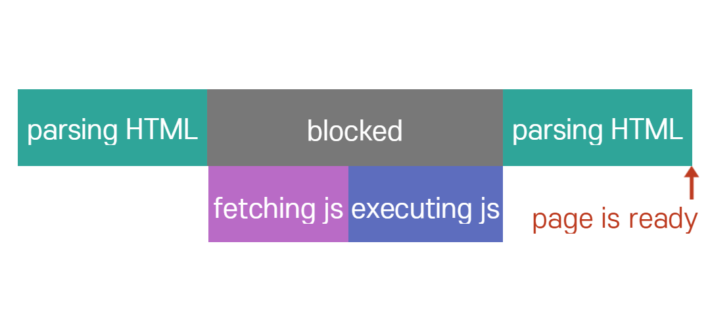
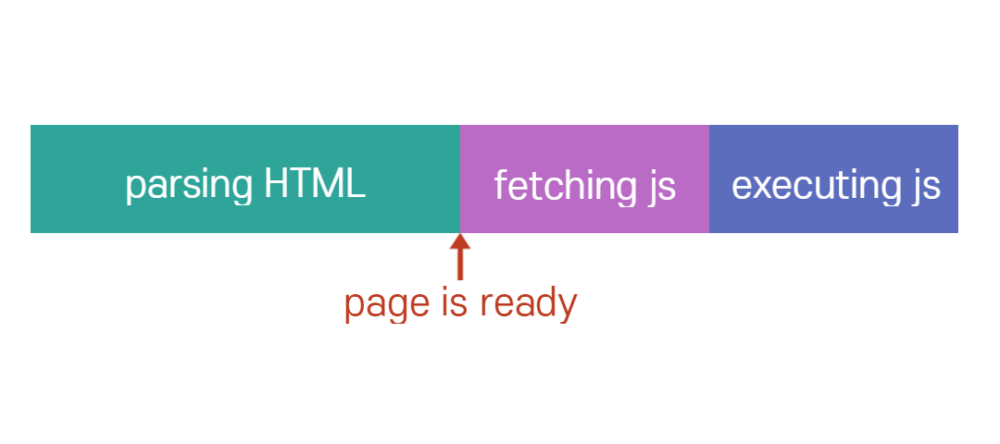
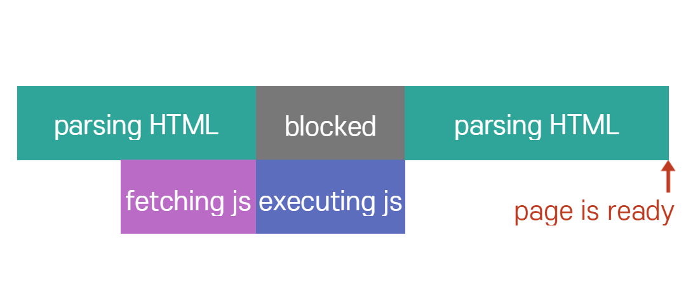
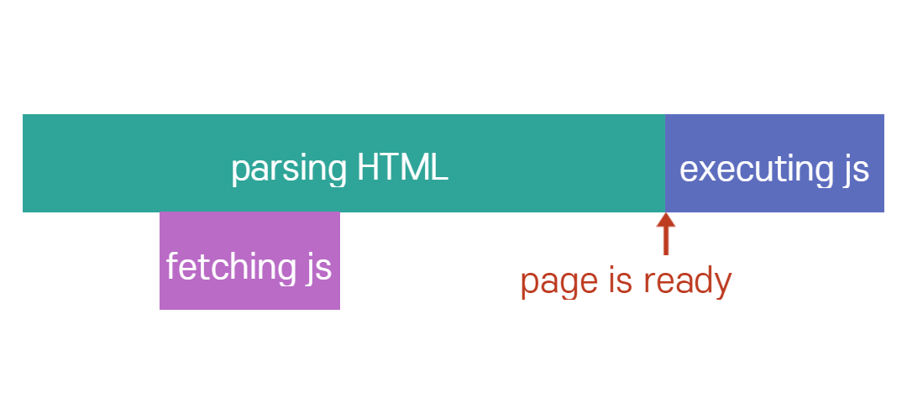

# JavaScript

## 목록

[Async vs. Defer](#Async vs. Defer)
[use strict](#use strict)

## Async vs. Defer

### HTML에서 `<script></script>` 의 기본적인 사용법

- HEAD에 포함

  ```html
  <!DOCTYPE html>
  <html lang="en">
    <head>
      <meta charset="UTF-8" />
      <meta name="viewport" content="width=device-width, initial-scale=1.0" />
      <title>Document</title>
      <!-- 1. 기본 -->
      <script src="main.js"></script>
    </head>
    <body></body>
  </html>
  ```

  

  - HTML 파싱을 통해 페이지를 불러오는 도중에 `<script>`를 만나 파싱을 잠시 멈추고 `<script>` 코드를 불러와 실행한 후 진행한다.

  - JS 파일의 용량이 크고 인터넷이 느릴 경우 page를 로드하는데 오랜시간이 소요된다.

- BODY에 포함

  ```html
  <!DOCTYPE html>
  <html lang="en">
    <head>
      <meta charset="UTF-8" />
      <meta name="viewport" content="width=device-width, initial-scale=1.0" />
      <title>Document</title>
    </head>
    <body>
      <!-- 1. 기본 -->
      <script src="main.js"></script>
    </body>
  </html>
  ```

  

  - Page를 모두 로드하고 `<script>`를 실행한다.

  - Page에서 JS를 통해 기능을 만들어준 경우 Page가 모두 로드되고난 후 스크립트가 실행될때까지 기다리고 나서야 정상적인 페이지를 확인할 수 있다.

### head + async

```html
<!DOCTYPE html>
<html lang="en">
  <head>
    <meta charset="UTF-8" />
    <meta name="viewport" content="width=device-width, initial-scale=1.0" />
    <title>Document</title>
    <!-- 2. async -->
    <script asyn src="main.js"></script>
  </head>
  <body></body>
</html>
```



- `head`안에 `script`를 이용하되 `asyn` 속성값을 사용

  1. 브라우저가 `html`을 실행하다가 `script`를 만나면 `main.js`를 병렬적으로 다운로드한다.

  2. 다운로드가 끝난 후 파싱을 멈추고 다운받은 js파일을 실행한다.

- 다운로드 받는 시간을 절약할 수 있다.

- 하지만, js파일에서 쿼리 selector를 이용해서 DOM요소를 조작할 때 조작하려는 시점에 원하는 html요소가 아직 정의되지 않았을 수도 있음.

- html을 파싱하는 동안 멈춰야하는 시간이 마찬가지로 존재하므로 사용자가 페이지를 확인하는데 걸리는 시간이 길어짐

### head + defer

```html
<!DOCTYPE html>
<html lang="en">
  <head>
    <meta charset="UTF-8" />
    <meta name="viewport" content="width=device-width, initial-scale=1.0" />
    <title>Document</title>
    <!-- 2. defer -->
    <script defer src="main.js"></script>
  </head>
  <body></body>
</html>
```



- `head`안에 `script`를 이용하되 `defer` 속성값을 사용

  1. 브라우저가 `html`을 실행하다가 `script`를 만나면 `main.js`를 병렬적으로 다운로드한다.

  2. 파싱이 끝난 후 사용자에게 페이지를 보여준 다음 다운받은 js파일을 실행한다.

- 가장 효율적이고 안전한 방법

## use strict

JavaScript 코드를 작성할 때 항상 가장위에 `'use strict';`를 입력해 주는 것이 좋다.

- JavaScript는 매우 유연한 언어로 예상치못한 실수를 할 수 있다.

- ECMAScript5에 추가됨

- 사용 예시

  ```js
  "use strict";
  console.log("Hello World!");

  let a; // a를 선언해주었을 때와 선언하지 않았을 때를 비교해보자.

  a = 6;
  ```
