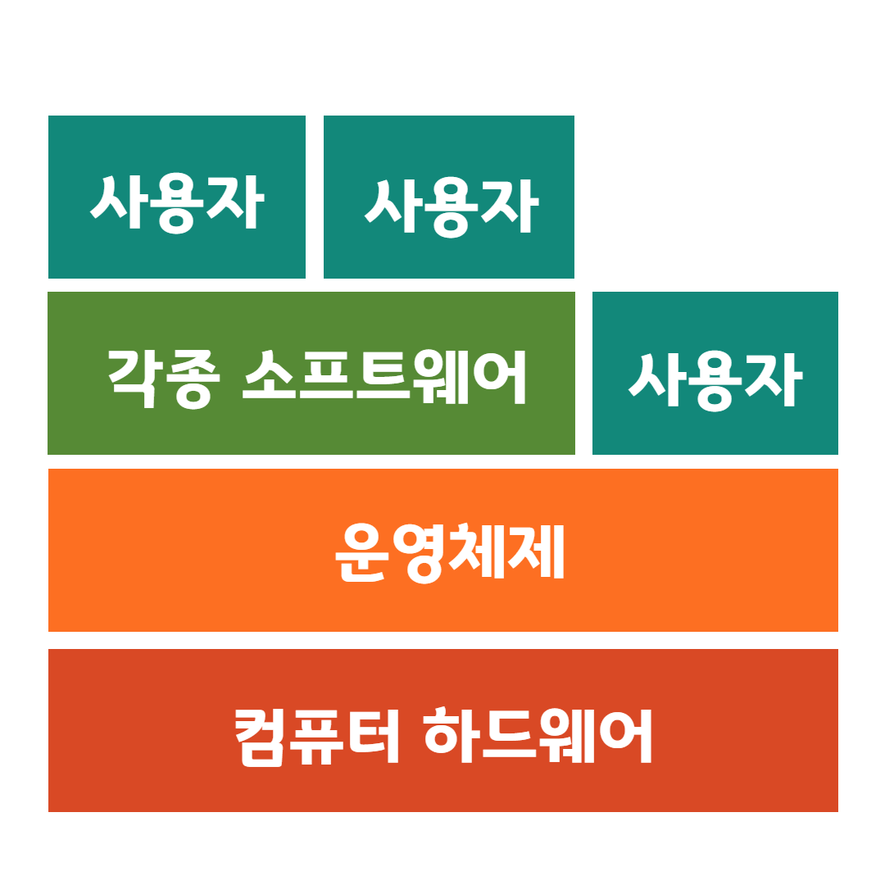
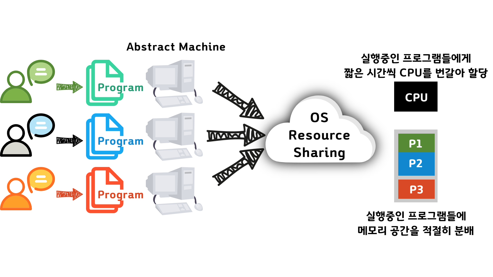

# Operating System

> 반효경 교수님의 강의를 들으며 공부한 내용을 정리해둔 자료입니다.
>
> [KOCW 강의 링크](http://www.kocw.net/home/search/kemView.do?kemId=1046323)

## 목차

* [운영체제란 무엇인가](#운영체제란-무엇인가)

## 운영체제란 무엇인가

### 운영체제란(Operating System, OS)란?

* 컴퓨터 하드웨어 바로 위에 설치되어 사용자와 다른 모든 소프트웨어들을 하드웨어와 연결해주는 소프트웨어 개층

  

* 컴퓨터 시스템을 편리하게 사용할 수 있는 환경을 제공해준다.

  * 하드웨어를 직접 다루는 복잡한 부분을 운영체제가 해준다.

* 컴퓨터 시스템의 **자원을 효율적으로 관리**

  * 프로세서, 기억장치, 입출력 장치 등의 효율적 관리

  

  

  