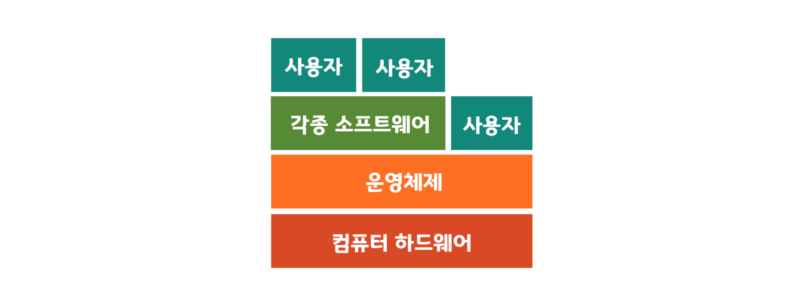

# Operating System

> 반효경 교수님의 강의를 들으며 공부한 내용을 정리해둔 자료입니다.
>
> [KOCW 강의 링크](http://www.kocw.net/home/search/kemView.do?kemId=1046323)

## 목차

* [운영체제란 무엇인가](#운영체제란-무엇인가)

## 운영 체제란 무엇인가

### 운영 체제란(Operating System, OS)란?

* 컴퓨터 하드웨어 바로 위에 설치되어 사용자와 다른 모든 소프트웨어들을 하드웨어와 연결해주는 소프트웨어 개층

  

* 컴퓨터 시스템을 편리하게 사용할 수 있는 환경을 제공해준다.

  * 하드웨어를 직접 다루는 복잡한 부분을 운영체제가 해준다.

* 컴퓨터 시스템의 **자원을 효율적으로 관리**

  * 프로세서, 기억장치, 입출력 장치 등의 효율적 관리

  

### 운영 체제의 분류

#### 동시 작업 가능 여부

##### 단일 작업(Single tasking)

* 한 번에 하나의 작업만 처리

  예) MS-DOS 프롬프트 상에서는 한 명령의 수행을 끝내기 전에 다른 명령을 수행시킬 수 없음

##### 다중 작업(Multi tasking)

  * 동시에 두 개 이상의 작업 처리

    예) UNIX, MS Windows 등에서는 한 명령어의 수행이 끝나기 전에 다른 명령이나 프로그램을 수행할 수 있음

#### 사용자의 수

##### 단일 사용자(Single user)

​	예) MS-DOS, MS Windows

##### 다중 사용자(Multi user)

​	예) UNIX, NT server

#### 처리방식

##### 일괄 처리(Batch processing)

* 작업 요청이 일정량 모일 때까지 기다렸다가 한번에 처리

* 작업이 모두 종료될 때까지 기다려야 한다.

  예) 초기 Punch Card 처리 시스템, OMR 카드

##### 시분할(Time sharing)

* 여러 작업이 동시에 실행 될 때 운영체제가 작은 시간 단위로 나누어 번갈아 할당하며 사용한다.
* 일괄 처리 시스템에 비해 짧은 응답 시간 (예: UNIX)
* Interactive한 방식(내가 어떠한 조작을 했을 때 바로 표시가 되는것)

##### 실시간(Realtime OS)

* Deadline이 있어 정해진 시간 안에 반드시 결과가 나오는 것을 보장해주는 시스템

  예) 원자로/공장 제어, 미사일 제어, 반도체 장비, 로봇 제어

##### 실시간 시스템의 개념 확장

* Hard realtime system (경성 실시간 시스템)
* Soft realtime system (연성 실시간 시스템)

### 혼동하기 쉬운 Multi-

> 공부를 하다보면 Multi로 시작하는 여러 용어들을 접한다. 서로 유사한 특성과 명칭 때문에 헷갈리기 쉬운 용어들을 정리하고 지나가자.

* 아래의 용어들은 비슷한 의미로 사용된다.

  * Multitasking

    여러작업이 동시에 실행되는 것을 뜻하는 일반적인 용어

  * Multiprogramming

    메모리에 여러 프로그램이 동시에 올라가 있을 때

  * Time sharing

    CPU의 시간을 분할하여 나누어 쓸 때

  * Multiprocess

    여러 프로그램이 동시에 실행될 때

* **Multiprocessor**는 위의 용어들과는 명확한 차이가 있다.

  * **Multiprocessor**

    하나의 컴퓨터에 CPU (processor)가 여러 개 붙어 있음을 의미

  * 위의 다른 용어들은 CPU의 개수에 상관없이 여러작업을 동시에 실행하는 것을 뜻하지만, **Multiprocessor** 기본적으로 CPU가 여러개있는 환경을 뜻 한다.

### 운영 체제의 예

#### 유닉스(UNIX)

> 초창기에 대형 컴퓨터를 위해 만들어진 운영 체제

* 멀티 작업(Multi tasking), 다중 사용자(Multi user) 지원

* 어셈블리어 밖에 없던 시절 코드가 복잡해지고 어려워 새로운 프로그래밍 언어를 개발

  -> C언어의 시작

* 코드의 대부분을 C언어로 작성

  * 높은 이식성

* 소스 코드 공개

* 프로그램 개발에 용이

* 최소한의 커널 구조

* 확장성이 높음

* 다양한 버전

  * System V, FreeBSD, SunOS, Solaris
  * Linux
    * 공개 소프트웨어 방식, 소스 코드가 공개 되어있고 지금도 많이 사용되고 있다.
    * 안드로이드도 운영 체제 커널에 사용하고 있음

#### DOS(Disk Operating System)

> 개인용 컴퓨터를 위해 만들어진 운영 체제

* 단일 작업(Single tasking), 단일 사용자(Single user)
* Microsoft에서 1981년 IBM-PC를 위해 개발
* 메모리 관리 능력의 한계(주 기억 장치: 640KB)

#### MS Windows

* Microsoft의 다중 작업용 GUI 기반 운영 체제
* Plug and Play, 네트워크 환경 강화
* DOS용 응용 프로그램과 호환성 제공
* 불완전성
* 풍부한 자원 소프트웨어

#### Handheld device를 위한 OS

* PalmOS, Pocket PC (WinCE), Tiny OS