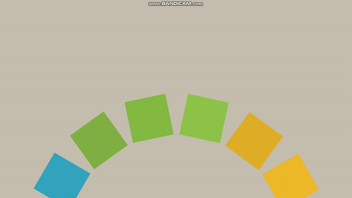
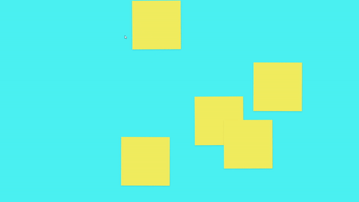

# INTERACTIVE UI

> `Interactive Developer`님의 `Youtube` 채널을 보며 학습한 내용입니다. [`Interactive Developer`님의 채널 링크](https://www.youtube.com/c/cmiscm) 

## MENU

- [Bouncing Ball](#Bouncing Ball)
- [Air Cap Wave](#Air Cap Wave)
- [Moving Waves](#Moving Waves)
- [Moving Gradient](#Moving Gradient)
- [Rotating Polygon](#Rotating Polygon)
- [Bounce Strings](#Bounce Strings)
- [Hanging Box](#Hanging Box)

## Bouncing Ball

- [코드](./bouncing_ball)

- 실행화면

  

## Air Cap Wave

* [코드](./air_cap_wave)

* 실행화면

  

## Moving Waves

* [코드](./moving_waves)

* 실행화면

  

## Moving Gradient

* [코드](./moving_gradient)

* 실행화면

  

## Rotating Polygon

* [코드](./rotating_polygon)

* 실행화면

  

## Bounce Strings

* [코드](./bounce_strings)

* 실행화면

  

## Hanging Box

* [코드](./hanging_box)

* 실행화면

  