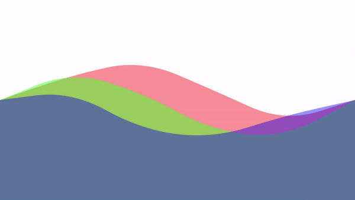

# INTERACTIVE UI

## MENU

- [Bouncing Ball](#Bouncing Ball)
- [Air Cap Wave](#Air Cap Wave)
- [Moving Waves](#Moving Waves)
- [Moving Gradient](#Moving Gradient)

## Bouncing Ball

- [코드](./bouncing_ball)

- 실행화면

  

## Air Cap Wave

* [코드](./air_cap_wave)

* 실행화면

  

## Moving Waves

* [코드](./moving_waves)

* 실행화면

  

## Moving Gradient

* [코드](./moving_gradient)

* 실행화면

  