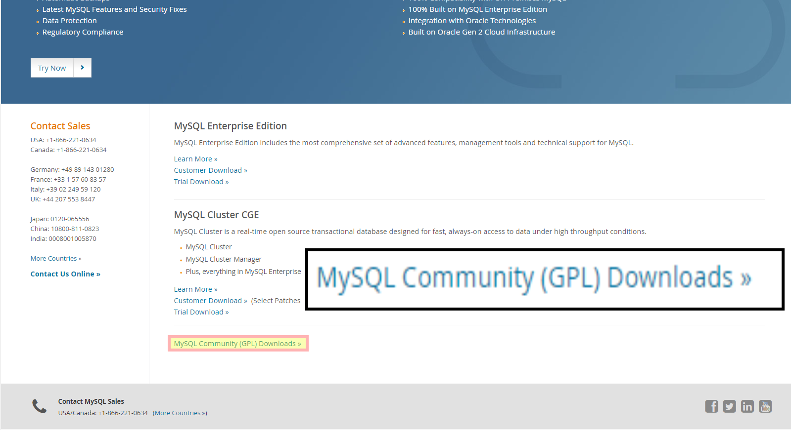
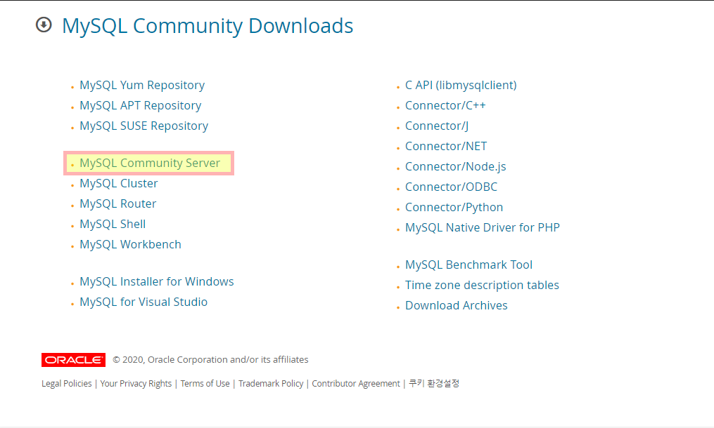
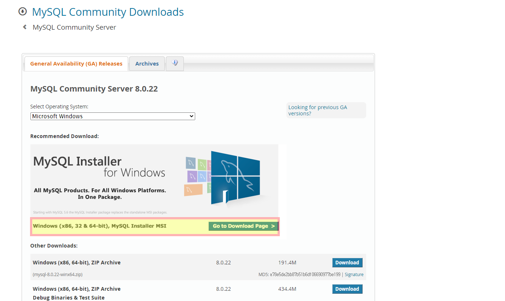
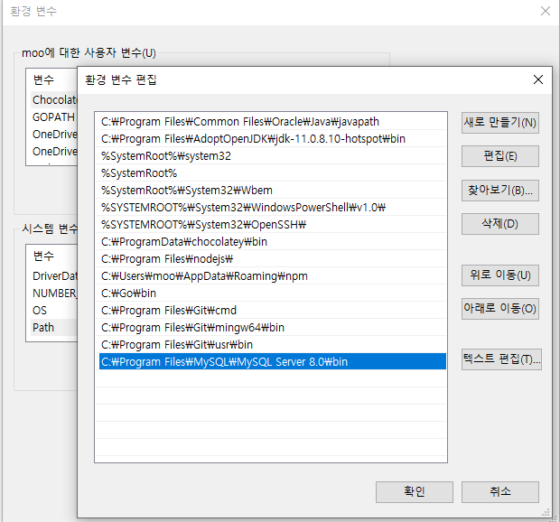

# Back-end

## 목차

* [SQL](#sql)
  * [SQL이란?](#sql이란?)
  * [Database 생성하기](#database-생성하기)
  * [MySQL 사용법](#mysql-사용법)

## SQL

### 1. SQL이란?

> **SQL(Structured Query Language)**

- SQL은 데이터를 보다 쉽게 검색하고 추가, 삭제, 수정 같은 조작을 할 수 있도록 고안된 컴퓨터 언어입니다.
- 관계형 데이터베이스에서 데이터를 조작하고 쿼리하는 표준 수단
- DML (Data Manipulation Language): 데이터를 조작하기 위해 사용
  INSERT, UPDATE, DELETE, SELECT 등이 해당
- DDL (Data Definition Language): 데이터베이스의 스키마를 정의하거나 조작하기 위해 사용
  CREATE, DROP, ALTER 등이 해당
- DCL (Data Control Language) : 데이터를 제어하는 언어
  권한을 관리하고, 테이터의 보안, 무결성 등을 정의
  GRANT, REVOKE 등이 해당

### 2. MySQL

#### MySQL 설치

##### Window10에서 MySQL 설치하기

1. 설치 프로그램 다운로드

   [https://www.mysql.com/downloads/](https://www.mysql.com/downloads/)

   

   

   

2. 환경변수 설정

   

#### Database 생성하기

* 콘솔에서 명령어 실행

  > MySQL 관리자 계정인 `root`로 데이터베이스 관리 시스템에 접속

  ```mysql
  mysql -u root -p
  Enter password: ****
  ```

* Database 생성 (I)

  > 관리자 계정으로 MySQL에 접속했을 경우

  - Database 생성

    ```mysql
    mysql> create database `DB이름`;
    ```

  * Database 사용자 생성과 권한 주기

    * Database를 생성했다면, 해당 데이터베이스를 사용하는 계정을 생성해야 한다.
    * 또한, 해당 계정이 데이터베이스를 이용할 수 있는 권한을 줘야 한다.
    * 아래와 같은 명령을 이용해서 사용자 생성과 권한을 줄 수 있다.
    ```mysql
    '8.0ver 이상에서는 create user를 먼저 해줘야함'
    create user '계정이름'@'localhost' identified by '암호'; // '8.0이상'
    
    grant all privileges on db이름.* to '계정이름'@'localhost' with grant option;
    
    flush privileges;
    ```
    
    * db이름 뒤의 * 는 모든 권한을 의미한다.
    * `@’%’`
      * 어떤 클라이언트에서든 접근 가능하다는 의미
    * `@’localhost’`
    
      * 해당 컴퓨터에서만 접근 가능하다는 의미
    * `ALL PRIVILEGES`
    
      * 모든 권한 추가
      * `SELECT, INSERT, UPDATE, DELETE, ... ` 으로 일부분만 추가 가능
    * `flush privileges` 
        * DBMS에게 적용
    * 해당 명령을 반드시 실행해줘야 한다.

#### MySQL 사용법

##### MySQL 버전과 현재 날짜 구하기

```mysql
mysql> select version(), current_date;
+-----------+--------------+
| version() | current_date |
+-----------+--------------+
| 8.0.22    | 2020-11-20   |
+-----------+--------------+
1 row in set (0.05 sec)
```

* 프롬프트에서는 SQL을 입력
* SQL은 `semicolon(;)`으로 끝난다.
* SQL은 쿼리(Query)라고 읽는다.
* 쿼리는 DBMS에게 명령을 내릴 때 사용하는 문장
* SELECT는 어떤 내용을 조회할 때 사용하는 키워드
* MySQL은 쿼리에 해당하는 결과의 전체 row를 출력하고 마지막에 전체 row 수와 쿼리실행에 걸린 시간을 표시

##### 키워드는 대소문자를 구별하지 않는다.

* 다음 쿼리들은 모두 같다.

  ```mysql
  mysql> SELECT VERSION(), CURRENT_DATE;
  mysql> select version(), current_date;
  mysql> SeLeCt vErSiOn(), current_DATE;
  ```

##### 쿼리를 이용해서 계산식의 결과도 구할 수 있다.

* 함수 및 수식 사용 예제

  ```mysql
  mysql> SELECT SIN(PI()/4), (4+1)*5;
  +--------------------+---------+
  | SIN(PI()/4)        | (4+1)*5 |
  +--------------------+---------+
  | 0.7071067811865476 |      25 |
  +--------------------+---------+
  1 row in set (0.01 sec)
  ```

##### 여러 문장을 한 줄에 연속으로 붙여서 실행가능

* 각 문장에 `semicolon(;)`만 붙여주면 됨

  ```mysql
  mysql> SELECT VERSION(); SELECT NOW();
  +-----------+
  | VERSION() |
  +-----------+
  | 8.0.22    |
  +-----------+
  1 row in set (0.00 sec)
  
  +---------------------+
  | NOW()               |
  +---------------------+
  | 2020-11-20 09:27:13 |
  +---------------------+
  1 row in set (0.04 sec)
  ```

##### 하나의 SQL은 여러 줄로 입력가능

* MySQL은 문장의 끝을 라인으로 구분하는 것이 아니라 `semicolon(;)`으로 구분하기 때문에 여러 줄에 거쳐 문장을 쓰는 것도 가능하다.

  ```mysql
  mysql> SELECT
      -> USER()
      -> ,
      -> CURRENT_DATE;
  +----------------+--------------+
  | USER()         | CURRENT_DATE |
  +----------------+--------------+
  | root@localhost | 2020-11-20   |
  +----------------+--------------+
  1 row in set (0.05 sec)
  ```

##### SQL을 입력하는 도중에 취소할 수 있다.

* 긴 쿼리를 작성하다가 중간에 취소해야 하는 경우에는 즉시 `\c`를 붙여주면 된다.

  ```mysql
  mysql> SELECT
      -> USER()
      -> \c
  mysql>
  ```

##### DBMS에 존재하는 데이터베이스 확인

* 작업하기 위한 데이터베이스를 선택하기 위해서는 어떤 데이터베이스가 존재하는지 알아보아야 한다.

* 현재 서버에 존재하는 데이터베이스를 찾아보기 위해서 `SHOW statement`을 사용

  ```mysql
  mysql> show databases;
  +--------------------+
  | Database           |
  +--------------------+
  | connectdb          |
  | information_schema |
  | mysql              |
  | performance_schema |
  | sakila             |
  | sys                |
  | world              |
  +--------------------+
  7 rows in set (0.16 sec)
  ```

##### 사용중인 데이터베이스 전환하기

* Database을 선택하기 위해, `"use" command`를 사용

  ```mysql
  mysql> use connectdb;
  Database changed
  ```

* 데이터베이스를 전환하려면, 이미 데이터베이스가 존재해야 하며 현재 접속 중인 계정이 해당 데이터베이스를 사용할 수 있는 권한이 있어야 한다.