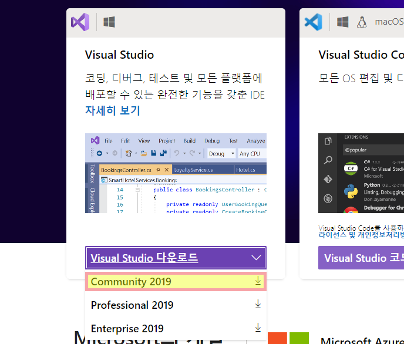
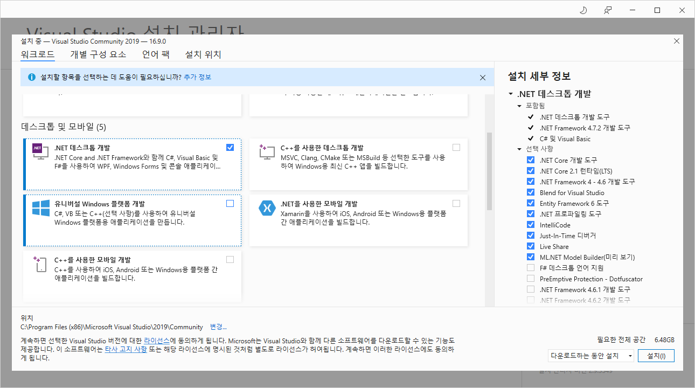
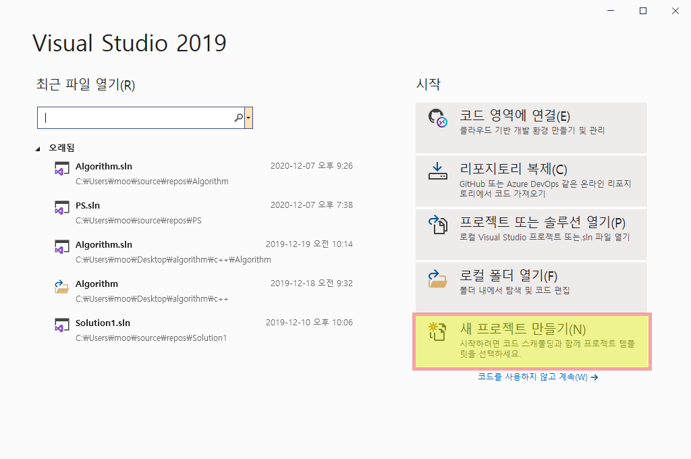
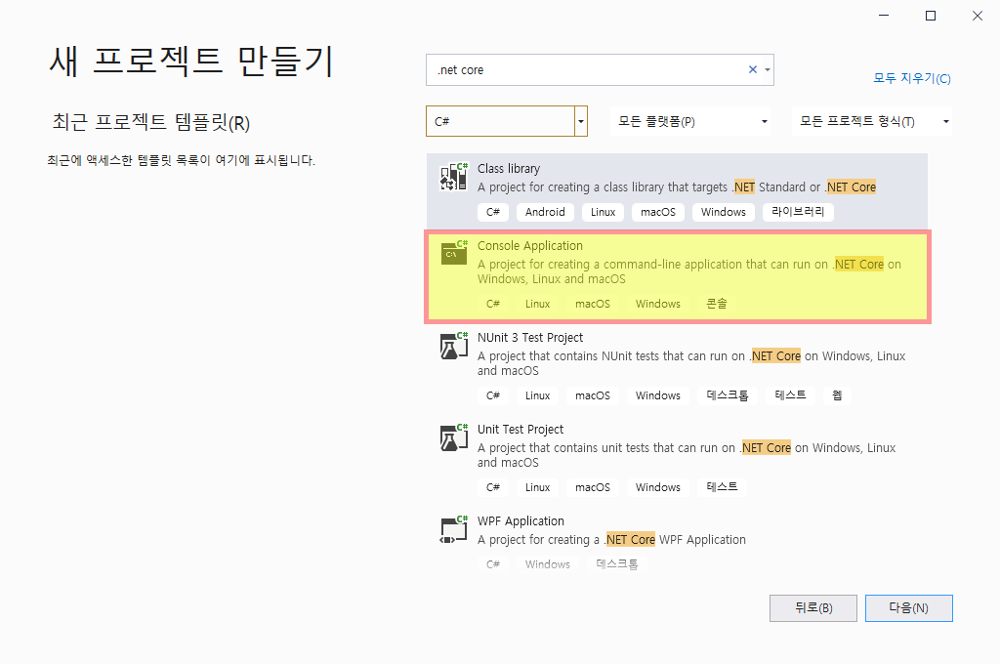
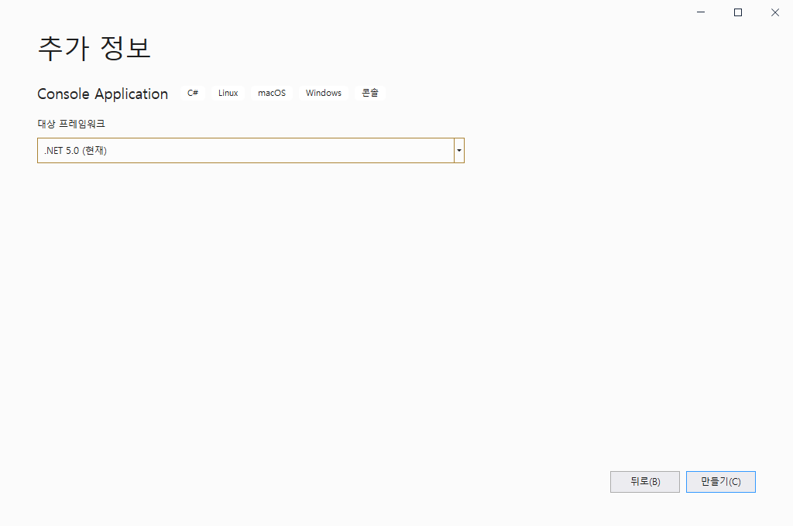
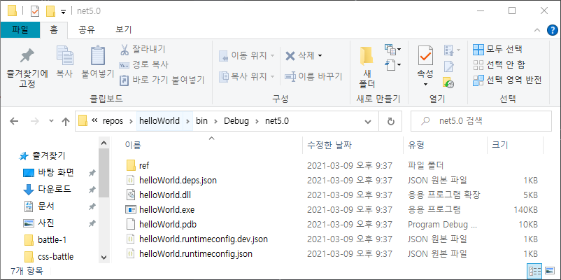

> **박상현 지음, 『이것이 C#이다』, 한빛미디어**를 보며 공부한 내용을 정리한 자료

# C#

## 목차

* [How to start C#](#how-to-start-c)

## How to start C#

### Visual Studio 설치

* [공식 사이트](https://visualstudio.microsoft.com/ko/)

* Visual Studio 다운로드 > Community 2019

  

* `.NET 데스크톱 개발` 선택 후 설치

  

### 새 프로젝트 생성

* 새 프로젝트 만들기

  

* `.net core` 검색 후 Console Application 선택

  

* `.NET 5.0` 버전 선택

  

### Hello, World!

* 코드 입력

  ```c#
  using System;
  using static System.Console;
  
  namespace helloWorld
  {
      class MainApp
      {
          // 프로그램 실행이 시작되는 곳
          static void Main(string[] args)
          {
              if (args.Length == 0)
              {
                  Console.WriteLine("사용법 : Hello.exe <이름>");
                  return;
              }
  
              WriteLine("Hello, {0}!", args[0]);
          }
      }
  }
  ```

* 컴파일

  * 키보드 `Ctrl + Shift + B`
  * 메뉴 바 `빌드 > 솔루션 빌드`

* 프로젝트 디렉터리 확인

  * 솔루션 탐색기에서 `프로젝트 항목` 우클릭 > `파일 탐색기에서 폴더 열기(X)` 선택

  * `bin/debug/net5.0` 디렉터리 확인

    

* 프로젝트 실행

  >  프로젝트 유형을 "콘솔 앱"으로 선택할 경우 명령 프롬프트에서 실행할 수 있다.

  * `cmd` 창에서 실행파일 경로 입력