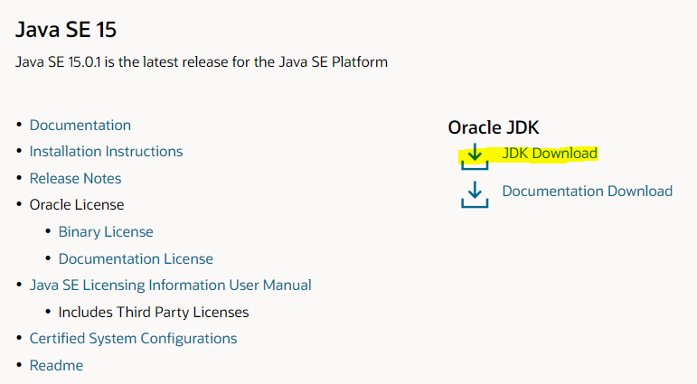
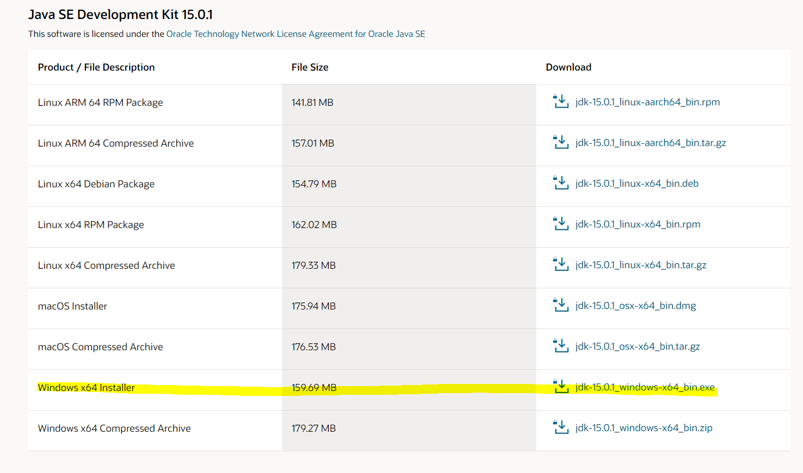
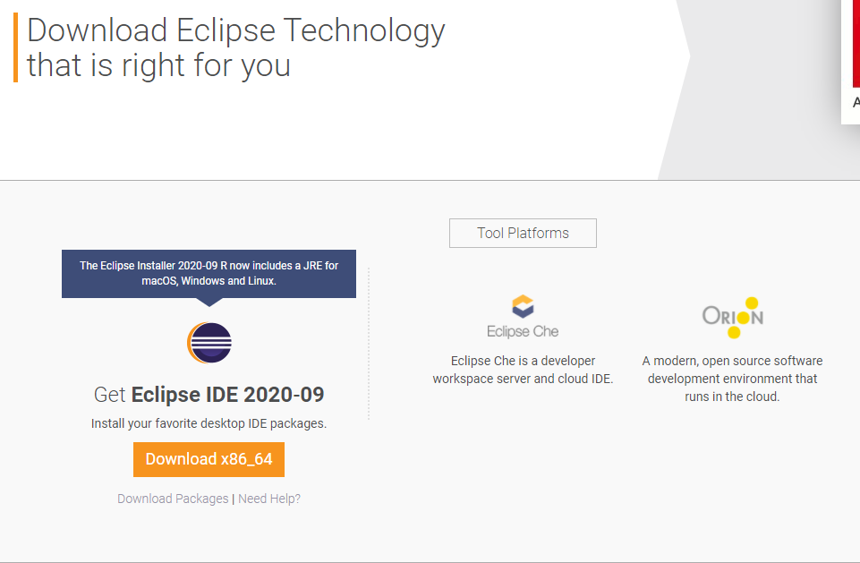
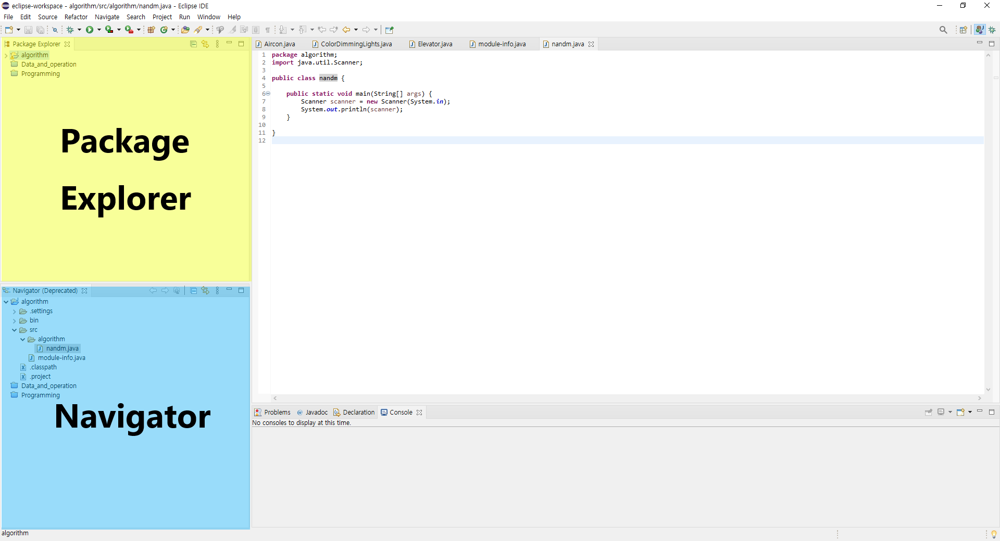

# Java

## 목차

* [Java 개발 환경 설정](#java-개발-환경-설정)
  * [Java 설치](#java-설치)
    * [버전 확인](#버전-확인)
    * [JDK 설치](#jdk-설치)
  * [Eclipse 설치](#eclipse-설치)


## Java 개발 환경 설정

### Java 설치

> window에서 Java 설치하기

#### 버전 확인

* Java 버전 확인
  * 입력

    ```bash
    java -version
    ```

  * 출력

    ```bash
    java version "15.0.1" 2020-10-20
    Java(TM) SE Runtime Environment (build 15.0.1+9-18)
    Java HotSpot(TM) 64-Bit Server VM (build 15.0.1+9-18, mixed mode, sharing)
    ```

* Javac 버전 확인

  * 입력

    ```bash
    javac -version
    ```

  * 출력

    ```bash
    javac 15.0.1
    ```

#### JDK 설치

* JDK란?

  * Java development kit
  * Java로 개발할 때 사용하는 여러 도구들을 모아서 제공하는 개발자용 자바

* [설치 페이지 링크](https://www.oracle.com/java/technologies/javase-downloads.html)

  * JDK Download 클릭

    

  * 본인의 OS에 맞게 설치

    

### Eclipse 설치

* [설치 페이지 링크](https://www.eclipse.org/downloads/)

  

## Java 애플리케이션 실행

* 실행화면

  

  * Navigator
    * 프로젝트 폴더를 있는 그대로 보여준다.
  * Package Explorer
    * 개발할때 편리하도록 바꿔서 보여준다.
    * 안쓰는것은 숨기고 조작 되어 처음 사용할때에는 혼란스러울 수 있다.

