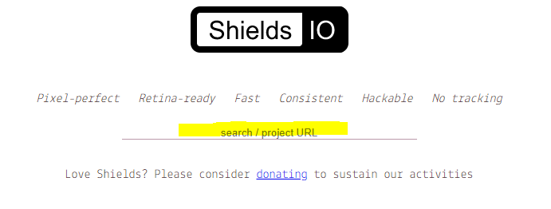
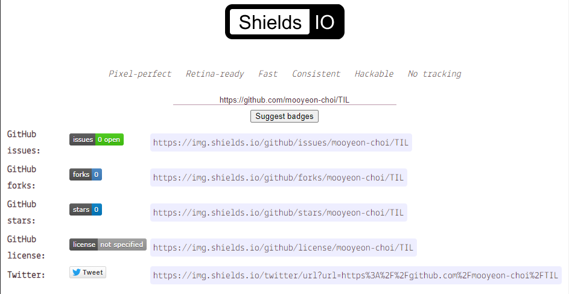

# Markdown

## 목차

* [참고하면 좋은 자료들](#참고하면-좋은-자료들)
* [Heading](#heading)
* [Paragraph](#paragraph)
* [Line](#line)
* [Text attributes](#text-attributes)
* [Quote](#quote)
* [Bullet list](#bullet-list)
* [Numbered list](#numbered-list)
* [Link](#link)
* [Image](#image)
* [Table](#table)
* [Code](#code)

## 참고하면 좋은 자료들

### [Typora](https://typora.io/)

```
Markdown 문법을 입력하면 바로바로 화면에 표시해주는 Markdown editor💁
입력창에서 바로 확인할 수 있어 문서📋를 작성할 때 보기 편하고 사용하기도 쉽다!
```

* 사용 예시

  

### [Github Markdown Emoji Markup](https://gist.github.com/rxaviers/7360908)

```
깃헙 markdown에서 사용할 수 있는 Emoji😊를 모아놓은 rxaviers님의 gist페이지
ctrl + F 로 간단하게 사용하고 싶은 Emoji를 찾아 복사해서 쓰면 된다!
```

### [Shields.io](https://shields.io/)

```
다양한 뱃지를 만들어주는 사이트 깃헙 README에 사용하면 좀 더 보기좋게 꾸밀 수 있다.
```

 [](https://hits.seeyoufarm.com/) [](https://codeforces.com/profile/mooyeon) [](https://solved.ac/memoria22) [](https://moo-choi.tistory.com/)

```
뿐만 아니라 아래와 같이 내 프로젝트 Repository의 URL을 입력하면 자동으로 추천 Badge들을 생성해주어 쉽게 만들어줄 수 있다
```





## Heading

```
# Heading 1
## Heading 2
### Heading 3
#### Heading 4
##### Heading 5
###### Heading 6
```

# Heading 1
## Heading 2
### Heading 3
#### Heading 4
##### Heading 5
###### Heading 6


## Line

```
paragraph
___ (언더바를 세번 입력해준다.)
```

paragraph

___

## Text attributes

```
This is the **bold** text and this is the *italic* text and let's do ~~strikethrough~~.
```

This is the **bold** text and this is the *italic* text and let's do ~~strikethrough~~.

## Quote

```
> Don't forget to code your dream.
```

> Don't forget to code your dream.

## Bullet list

```
Fruits:
* 🍎
* 🍋
Other fruits:
- 🍑
- 🍏
```

Fruits:
* 🍎
* 🍋

Other fruits:
- 🍑
- 🍏

## Numbered list

```
Numbers:
1. first
2. second
3. third
```

Numbers:
1. first
2. second
3. third

## Link

```
[Click](https://github.com/mooyeon-choi)
[문서 내 이동](#문서-내-이동)
## 문서 내의 Heading으로도 이동할 수 있다 이때 띄어쓰기는 '-'로 입력해주어야한다.
```

[Click](https://github.com/mooyeon-choi)

### 문서 내 이동

[문서 내 이동](#문서-내-이동)

## Image

```

## img Tag

```


## Table

```
|Header|Description1|Description2|
|--:|:--|:--:|  ## 오른쪽, 왼쪽, 가운데 정렬
|cell1|cell2|cell3|
|cell1|cell2|cell3|
```
|Header|Description1|Description2|
|--:|:--|:--:|
|cell1|cell2|cell3|
|cell1|cell2|cell3|

## Code

```
# `(백틱) 키
To pring message in the console, use `console.log('your message')` and ..

​```ts
console.log('your message')
​```
```

To pring message in the console, use `console.log('your message')` and ..

```ts
console.log('your message')
```