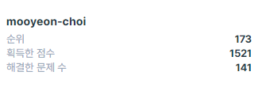
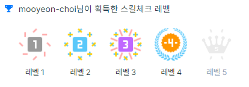

# Problem Solving

> Python, Java, JavaScript, C++로 알고리즘을 학습하고 문제를 풀어보며 정리한 내용입니다.

## 목차

* [Codeforces](#codeforces)
* [Baekjoon Online Judge](#baekjoon-online-judge)
* [Programmers](#programmers)
* [SW Expert Academy](#sw-expert-academy)
* [카카오 2차 기출 문제 풀이](#카카오-2차-기출-문제-풀이)

## Codeforces

[](https://codeforces.com/profile/mooyeon)

* [바로가기](./codeforces)

```
📊Codeforces Contest에 참가하며 푼 문제들을 모아두었습니다.
20년 12월 18일📆
현재점수- 1387점 Green💹
🎓1900점을 넘어 🍊Orange까지!!
```

## Baekjoon Online Judge

[](https://solved.ac/memoria22)

* [바로가기](./baekjoon)

```
Baekjoon Online Judge 사이트에서 여러 코딩테스트 문제들을 풀어보며 실력을 쌓고 기록해두었습니다.
20년 12월 18일📆
현재점수 - Gold 5 / Class 1
🎓플레를 넘어~ 💎다이아갈꺼야~~
```

## Programmers





* [바로가기](./programmers)

```
카카오 기출문제와 여러 유형별 문제를 풀어보고 연습하는 사이트
20년 12월 18일📆
현재점수 - 1521 / 173위 / Level 4
랭킹 두자리 수🏆, Level 5 를 향해!!
```

## SW Expert Academy

* [바로가기](./swExpertAcademy)

## 카카오 2차 기출 문제 풀이

* [바로가기](./kakao_2nd)