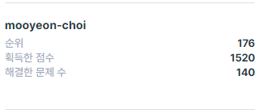

# Programmers

> 카카오, 네이버, 라인 등 많은 회사의 코딩테스트를 담당하는 프로그래머스의 UI에 익숙해지기 위해 문제를 풀어보자

## 현재 프로필(2020-12-09)

## 목차

* [Level 1](#level-1)
* [Level 2](#level-2)
* [Level 3](#level-3)
* [Level 4](#level-4)

## Level 1

> 기본적인 반복문, 수식 사용법을 활용한 문제 풀이

* [Java 바로가기](./level_1_java)

## Level 2

> 해시, 힙, 정렬, 그래프 탐색등 기본적인 알고리즘 활용

* [Java 바로가기](./level_2_java)

## Level 3

> 기업 코딩테스트를 통과하기 위해

* [Python 바로가기](./level_3_python)

## Level 4

> 고득점을 위하여!

* [Python 바로가기](./level_4_python)