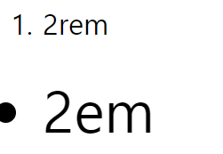
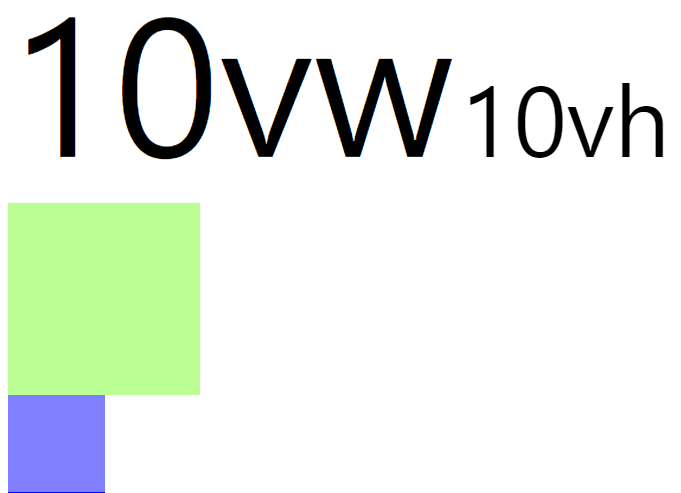
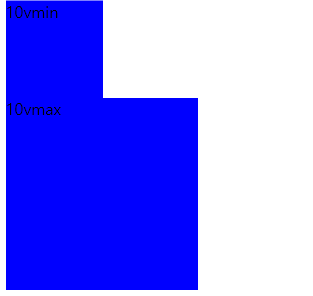

# 02. CSS(Cascading Style Sheets)

* Style sheet language

> HTML이 기본적인 구조를 만든다면 CSS는 꾸며주기 위한 language

## 목차

* [CSS 활용하기](#css-활용하기)
* [Selector](#selector)
* [Unit](#unit)

## CSS 활용하기

### CSS 사용법

#### Inline(인라인)

>  인라인으로 작성이 가능하지만 그 한줄에만 적용 가능하고 나중에 찾기 힘드므로 권장하지 않음

```html
<p id="green" style="color: purple;">인라인 CSS 활용</p> 
```

* HTML 요소의 style에 CSS를 넣기


#### embed(내부참조)

> head 태그 내에 style 태그

```html
<head>
  <style>
   내용
  </style>
</head>
```

* HTML 내부에 CSS를 포함시키기


#### link file(외부참조)

> 재사용이 가능하므로 일반적으로 사용한다.

```html
<link rel="stylesheet" href="01_style.css">
```

* 외부에 있는 CSS 파일을 로드하기


#### CSS 단위

[자주 사용하는 CSS 속성값들](https://developer.microsoft.com/en-us/microsoft-edge/platform/usage/)

프로퍼티 값의 단위

```css
h1 {color:blue;font-size:15px;}
```

* `blue`, `15px` : 값(Value)

* `color`, `font-size` : 키워드(크기단위, 색깔 등)

  > 크롬 우클릭 > 검사 > styles에서 개발자 도구로 확인 가능


1. 크기 단위

   1. px : 화면을 구성하는 단위 (디바이스 별로 픽셀의 크기가 다르다.)

   2. % : 백분율 단위의 상대 단위

      요소에 지정된 사이즈(상속된 사이즈나 디폴트 사이즈)에 상대적인 사이즈를 설정한다.

      

   3. **em과 rem** :

      * em: 배수 단위로 상대 단위이다


### 선택자 우선순위

```html
<body>
  <!-- 선택자는 우선순위가 있다.
        id > class > tag
        id는 문서에서 반드시 한번만 등장!
        class는 문서에서 여러번 등장!
        따라서 중복으로 사용할 때에는 class를 사용한다.
  -->
  <h1>Hello, CSS!</h1>
  <h2 class="blue">선택자</h2>
  <h3 class="blue">태그 선택자</h3> <!-- 우선순위: 클래스 선택자 > 태그 선택자 -->
  <h3 id="green">클래스 선택자</h3> <!-- id 선택자 > 태그 선택자 -->
  <h3 id="green" class="blue">아이디 선택자</h3> <!-- 아이디 선택자 > 클래스 선택자 -->
  <!-- style에서 선언하지 않고 < >내에서 정해준게 우선 -->
  <p id="green" style="color: purple;">인라인 CSS 활용</p> 
  <!-- !important가 CSS 적용이 가장 우선된다.
      하지만, 사용에 주의하자. 남발하지 말자.
  -->
  <p id="green" class="blue brown" style="color: purple">무슨 색일까요?</p>
</body>
```

* `!important` : 우선 순위를 가장 높게 바꿔준다. 사용할 경우 코드가 꼬일 수 있어 거의 사용하지 않는다. (같은 선택자라면 가장 아래에 있는 것이 우선, 다른 선택자라면 선택자들 간의 우선순위에 따라 결정)
* 기본적으로 id > class > tag 순이다.
* id 선택자의 경우 한번만 사용하야하므로 우선순위가 가장 높다.
* inline(인라인)으로 사용해 준 경우 우선순위가 가장 높다.

## Selector

### 선택자 적용법

#### 그룹 선택자

```css
h1, h2, h3, h4, h5, h6, .silver {
  color: silver;
}
```

* 요소들을 묶어서 한번에 처리해줄 수 있다.

#### 인접 선택자

```css
.blue + .red + div {
  background-color: purple;
}
```

```html
  <div class="blue"></div>
  <div class="red"></div>
  <div>CSS is awesome!</div>
```

* `.blue` -> `.red` -> `div` 순으로 코드가 실행될 경우 지정해준 style로 나타나도록 정해줄 수 있다.

#### 자식 선택자 vs 후손 선택자

> 자식 선택자의 경우 지정해준 순서로 포함된 경우에만 실행이 되도록 하고,
>
> 후손 선택자의 경우 지정해준 클래스 아래에 속해있다면 모두 실행된다.

```css
/* 자식 선택자 (바로 밑에 있을 경우) */
.parent > li {
  color: red;
}

/* 후손 선택자 (속해있다면 모두) */
.ancestor li {
  color: blue
}
```

```html
  <ol class="parent">
    <ul>
      <li>ol>ul>li</li>
    </ul>
  </ol>
  <ol class="parent">
    <li>ol>li</li>
  </ol>
  <ol class="ancestor">
    <ul>
      <li>ol>ul>li</li>
    </ul>
  </ol>
  <ol class="ancestor">
    <li>ol>li</li>
  </ol>
```

* 실행 결과


> 자식 선택자를 사용하였을 경우 `ol`바로 아래에 `li`가 있는 경우만 실행 되는 것을 확인 할 수 있고,
>
> 후손 선택자를 사용하였을 경우 `ol` 안에 `li` 가 속한경우 모두 실행되는 것을 알 수 있다.

## Unit

### 폰트의 크기

> rem은 root 요소의 배수!
>
> em은 상위 요소의 배수!



```css
ol, ol li {
  font-size: 2rem;
}

ul, ul li {
  font-size: 2em;
}
```

```html
<!-- rem -->
<ol>
    <li>2rem</li>
</ol>
<!-- em -->
<ul>
    <li>2em</li>
</ul>
```

1. rem

   * root 요소의 배수
   * html : 16px (브라우저 기본)
   * ol : 2rem -> 32px (16px * 2)
   * li : 2rem -> 32px (16px * 2)

2. em

   * 상위 요소의 배수

   * html : 16px

   * ul : 2em -> 32px

   * li : 원래 ul 밑에 있어서 32px

     ​	2em -> 32px * 2 -> 64px

### Element의 상대적인 크기 설정

1. vw와 vh

   > 현재 실행중인 스크린 크기에 맞춰 상대적인 view port의 너비와 높이

   

   ```css
   .vw {
     font-size: 10vw;
   }
   
   .vh {
     font-size: 10vh;
   }
   
   .div-vw {
     width: 10vw;
     height: 10vw;
     background-color: rgba(94, 255, 0, 0.418);
   }
   
   .div-vh {
     width: 10vh;
     height: 10vh;
     background-color: rgba(0, 0, 255, 0.5);
   }
   ```

   ```html
   <span class="vw">10vw</span>
   <span class="vh">10vh</span>
   <div class="div-vw"></div>
   <div class="div-vh"></div>
   ```

   * 숫자는 %를 나타낸다. (ex : 10vw -> 스크린 너비의 10%)
   * vw : 스크린 너비에 대비
   * vh : 스크린 높이에 대비
   * `width: 10vh;, height: 10vw`와 같은 방식으로도 사용 가능하다.

2. %와 vh, vw

   > 이미 우리는 `%`를 사용하여 상대적인 크기를 적용할 수 있다.
   >
   > 그럼, `vh`와 `vw`는 `%`와 어떤 차이가 있어 사용하는 것 일까?

   

   vh 와 vw 는 **화면 전체의 상대적인 크기**이기 때문에 **스크롤 바를 포함한 크기를 사용한다.**

   반면에 `%` 는 창이 중심이 아닌 **부모 요소의 크기**에 맞게 반환한다. 또한 전체 화면에서 % 사용할 경우 **스크롤 바를 제외한 화면의 크기를 사용한다.**

   내부 요소가 동적으로 변화할 때 스크롤 바가 발생할 경우 %를 사용하면 Element의 크기가 이에 맞춰 변하게 된다. 이를 방지하기 위해 vw / vh를 사용한다.

3. vmin과 vmax

   > Viewport의 크기 중 더 긴 것을 기준으로 삼으면 vmax, 더 짧은 것을 기준으로 삼으면 vmin을 사용한다.

   

   ```css
   .div-vmin {
     width: 10vmin;
     height: 10vmin;
     background-color: #0000ff;
   }
   
   .div-vmax {
     width: 10vmax;
     height: 10vmax;
     background-color: #0000ff;
   }
   ```

   ```html
   <div class="div-vmin">10vmin</div>
   <div class="div-vmax">10vmax</div>
   ```

## 4. Box_model


## 5. Display

