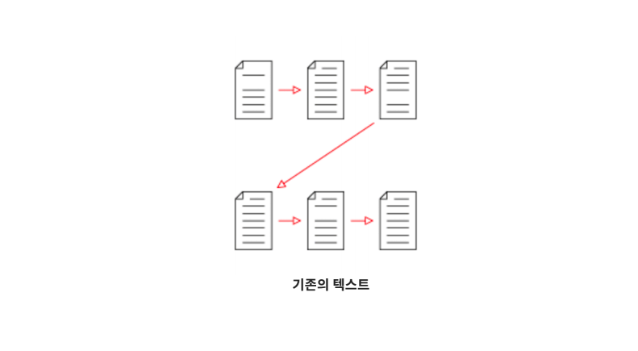
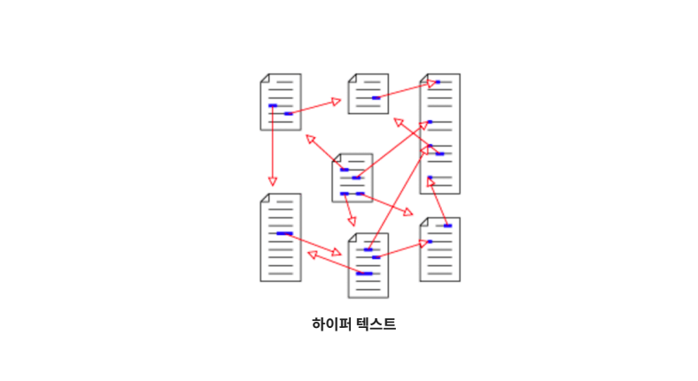

# 01. HTML (Hyper Text Markup Language)

> 사이사이에 링크가 있고 링크들이 서로 연결되어 있는 방식





* Hyper Text를 주고받는 규칙


## 1. HTML 문서의 기본 구조

```html
<!DOCTYPE html>  <!-- DOCTYPE 선언부 -->
```

* 사용하는 문서의 종류를 선언하는 부분, 보통 html을 사용한다.

```html
<html lang="ko">
</html>
```

* html 요소 :

  HTML문서의 최상위 요소로 문서의 root를 뜻한다. head와 body 부분으로 구분된다.

```html
<head>
  <meta charset="UTF-8">
  <title>Document</title>
</head>
```

* head 요소 :

  문서 제목, 문자코드(인코딩)와 같이 해당 문서 정보를 담고 있으며, 브라우저에 나타나지 않는다.

  CSS 선언 혹은 외부 로딩 파일 지정등도 작성한다.

```html
<body>
    
</body>
```

* body 요소 :

  브라우저 화면에 나타나는 정보로 실제 내용에 해당한다.


## 2. Tag와 DOM TREE

### 2.0 주석(Comment)

```html
<!-- 주석 내용 -- >
```

* HTML 에서 사용되는 주석 표기법(화면에 나오지 않음)

### 2.1 요소(Element)

```html
<h1>contents</h1>
```

* HTML의 element는 태그와 내용(contents)로 구성되어 있다.

  태그는 대소문자를 구별하지 않으나, 소문자로 작성해야 한다. 요소간의 중첩도 가능하다.

### 2.2 Self-closing element

```html

```

* 닫는 태그가 없는 태그도 존재한다.

### 2.3 속성(Attribute)

> '=' 양옆에 공백 X, 항상 ""(쌍따옴표) 사용

```html
<a href="https://google.com"/>
```

* `href` : 속성명
* `"https://google.com"` : 속성값
* 태그에는 속성이 지정될 수 있다. id, class, style 속성은 태그와 상관없이 모두 사용 가능하다.

### 2.4 DOM 트리

> 2 space(tap)를 사용한다.

```html
<body>
  <h1> 웹문서 </h1>
  <ul>
    <li>HTML</li>
    <li>CSS</li>
  </ul>
</body>
```

* body태그와 h1태그는 부모(parent)-자식(child)관계
* `h1`태그와 `ul`태그는 형제 관계(sibling)

### 2.5 시맨틱 태그(Semantic Tag)

> 개발자 및 사용자 뿐만 아니라 검색엔진(구글, 네이버) 등에 **의미 있는 정보의 그룹**을 태그로 표현하여 단순히 보여주기 위한 것을 넘어서 의미를 가지는 태그들을 활용하기 위한 노력!

```html
<div></div>
```

* 공간을 분할할 뿐 의미는 없다.

  display: block을 지정하기 위한 기본 레이아웃 태그!

* HTML5에서 새롭게 지정된 시맨틱 태그의 일부 :

|  태그   |                             설명                             |
| :-----: | :----------------------------------------------------------: |
| header  |                헤더 (문서 전체나 섹션의 헤더)                |
|   nav   |                          네비게이션                          |
|  aside  | 사이드에 위치한 공간으로, 메인 콘텐츠와 관련성이 적은 콘텐츠에 사용 |
| section | 문서의 일반적인 구분으로 컨텐츠의 그룹을 표현하며, 일반적으로 h1~h6요소를 가짐 |
| article | 문서, 페이지, 사이트 안에서 독립적으로 구분되는 영역(포럼/신문 등의 글 또는 기사) |
| footer  |                푸터 (문서 전체나 섹션의 푸터)                |

## 3. 실습

### 00. tags

[00_tags.html](./00_tags.html)

```html
<!-- !+tap -> emmet -->
<!DOCTYPE html>
<html lang="ko">
<head>
  <meta charset="UTF-8">
  <meta name="viewport" content="width=device-width, initial-scale=1.0">
  <meta http-equiv="X-UA-Compatible" content="ie=edge">
  <title>Document</title>
</head>
<body>
  <h1>문서의 제목 - 여는태그/닫는태그</h1>
  <!-- 닫는 태그가 없는 self-closing 태그도 있습니다. -->
  <input type="text"> <br> <!-- 엔터 (다음라인으로) -->
  
  <hr> <!-- 수평선을 그려주는 태그 -->
  <div><!-- 의미가 없지만, 레이아웃을 나누는 태그(display: block)-->
    <p>div 태그의 자식(child)</p>
    <p>위의 p태그와 형제(sibling)</p>
  </div>
  <footer> <!-- 시멘틱 태그 (HTMLS 에서 추가된 태그) -->
    <p>똑같은 영역인데, 여기는 푸터!</p>
  </footer>
</body>
</html>
```


### 01. semantic

[01_semantic.html](./01_semantic.html)

