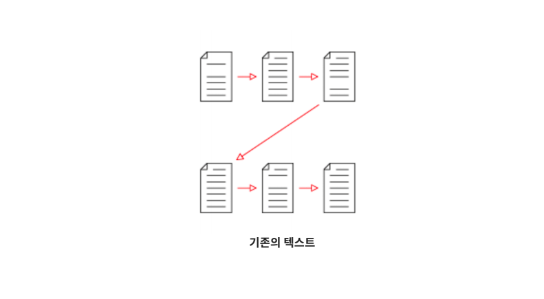
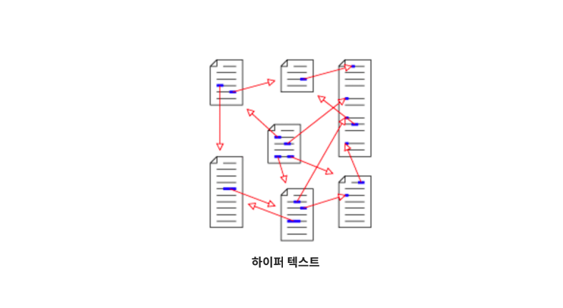
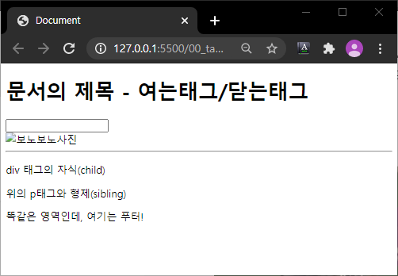
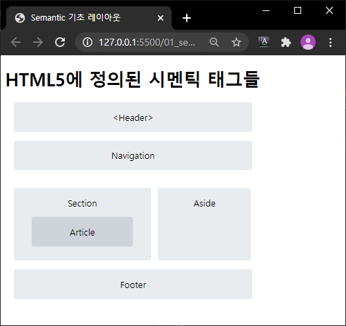
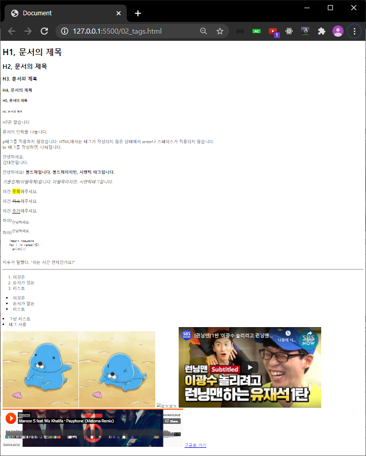
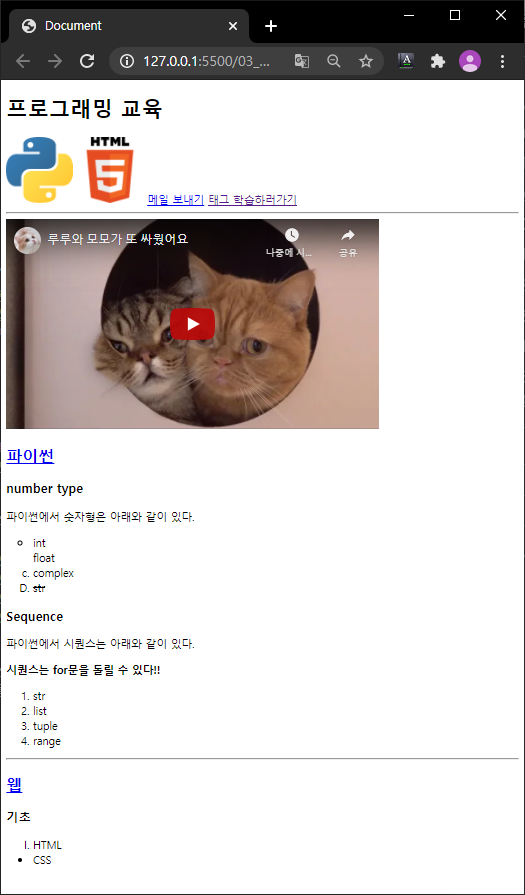
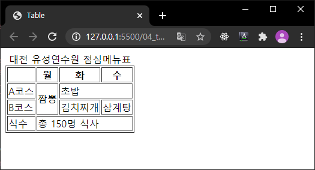
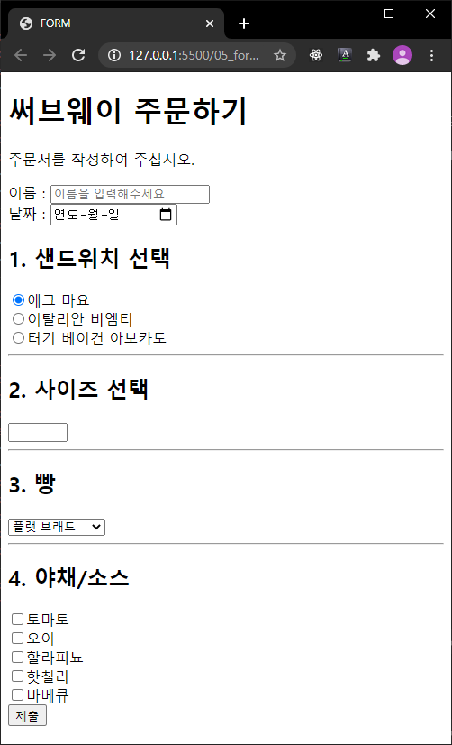

# 01. HTML (Hyper Text Markup Language)

> 사이사이에 링크가 있고 링크들이 서로 연결되어 있는 방식





* Hyper Text를 주고받는 규칙


## 1. HTML 문서의 기본 구조

```html
<!DOCTYPE html>  <!-- DOCTYPE 선언부 -->
```

* 사용하는 문서의 종류를 선언하는 부분, 보통 html을 사용한다.

```html
<html lang="ko">
</html>
```

* html 요소 :

  HTML문서의 최상위 요소로 문서의 root를 뜻한다. head와 body 부분으로 구분된다.

```html
<head>
  <meta charset="UTF-8">
  <title>Document</title>
</head>
```

* head 요소 :

  문서 제목, 문자코드(인코딩)와 같이 해당 문서 정보를 담고 있으며, 브라우저에 나타나지 않는다.

  CSS 선언 혹은 외부 로딩 파일 지정등도 작성한다.

```html
<body>
    
</body>
```

* body 요소 :

  브라우저 화면에 나타나는 정보로 실제 내용에 해당한다.


## 2. Tag와 DOM TREE

### 2.0 주석(Comment)

```html
<!-- 주석 내용 -- >
```

* HTML 에서 사용되는 주석 표기법(화면에 나오지 않음)

### 2.1 요소(Element)

```html
<h1>contents</h1>
```

* HTML의 element는 태그와 내용(contents)로 구성되어 있다.

  태그는 대소문자를 구별하지 않으나, 소문자로 작성해야 한다. 요소간의 중첩도 가능하다.

### 2.2 Self-closing element

```html

```

* 닫는 태그가 없는 태그도 존재한다.

### 2.3 속성(Attribute)

> '=' 양옆에 공백 X, 항상 ""(쌍따옴표) 사용

```html
<a href="https://google.com"/>
```

* `href` : 속성명
* `"https://google.com"` : 속성값
* 태그에는 속성이 지정될 수 있다. id, class, style 속성은 태그와 상관없이 모두 사용 가능하다.

### 2.4 DOM 트리

> 2 space(tap)를 사용한다.

```html
<body>
  <h1> 웹문서 </h1>
  <ul>
    <li>HTML</li>
    <li>CSS</li>
  </ul>
</body>
```

* body태그와 h1태그는 부모(parent)-자식(child)관계
* `h1`태그와 `ul`태그는 형제 관계(sibling)

### 2.5 시맨틱 태그(Semantic Tag)

> 개발자 및 사용자 뿐만 아니라 검색엔진(구글, 네이버) 등에 **의미 있는 정보의 그룹**을 태그로 표현하여 단순히 보여주기 위한 것을 넘어서 의미를 가지는 태그들을 활용하기 위한 노력!

```html
<div></div>
```

* 공간을 분할할 뿐 의미는 없다.

  display: block을 지정하기 위한 기본 레이아웃 태그!

* HTML5에서 새롭게 지정된 시맨틱 태그의 일부 :

|  태그   |                             설명                             |
| :-----: | :----------------------------------------------------------: |
| header  |                헤더 (문서 전체나 섹션의 헤더)                |
|   nav   |                          네비게이션                          |
|  aside  | 사이드에 위치한 공간으로, 메인 콘텐츠와 관련성이 적은 콘텐츠에 사용 |
| section | 문서의 일반적인 구분으로 컨텐츠의 그룹을 표현하며, 일반적으로 h1~h6요소를 가짐 |
| article | 문서, 페이지, 사이트 안에서 독립적으로 구분되는 영역(포럼/신문 등의 글 또는 기사) |
| footer  |                푸터 (문서 전체나 섹션의 푸터)                |

## 3. 실습

### 00. tags

* [코드 보기](./00_tags.html)

```html
<body>
  <h1>문서의 제목 - 여는태그/닫는태그</h1>
  <!-- 닫는 태그가 없는 self-closing 태그도 있습니다. -->
  <input type="text"> <br> <!-- 엔터 (다음라인으로) -->
  
  <hr> <!-- 수평선을 그려주는 태그 -->
  <div><!-- 의미가 없지만, 레이아웃을 나누는 태그(display: block)-->
    <p>div 태그의 자식(child)</p>
    <p>위의 p태그와 형제(sibling)</p>
  </div>
  <footer> <!-- 시멘틱 태그 (HTMLS 에서 추가된 태그) -->
    <p>똑같은 영역인데, 여기는 푸터!</p>
  </footer>
</body>
```




### 01. semantic

* [코드 보기](./01_semantic.html)

```html

<body>
  <h1>HTML5에 정의된 시멘틱 태그들</h1>
  <header>&lt;Header&gt;</header>
  <nav>Navigation</nav>
  <section>
    Section
    <article>
      Article
    </article>
  </section>
  <aside>
    Aside
  </aside>
  <footer>
    Footer
  </footer>
</body>
```




### 02. more tags

* [코드 보기](./02_tags.html)

```html
<!-- 1. Heading(제목) -->
<h1>H1, 문서의 제목</h1>
<h2>H2, 문서의 제목</h2>
<h3>H3, 문서의 제목</h3>
<h4>H4, 문서의 제목</h4>
<h5>H5, 문서의 제목</h5>
<h6>H6, 문서의 제목</h6>
<h7>H7은 없습니다</h7>
<!-- 2. 문서의 단락(paragraph) -->
<p>문서의 단락을 나눕니다.</p>
p태그를 적용하지 않았습니다.
<!-- 3, br -->
HTML에서는 태그가 작성되지 않은 상태에서 enter나 스페이스가 적용되지 않습니다.
<br> br 태그를 작성하면, 나눠집니다.
<p>안녕하세요.<br>김대전입니다.</p>
<!-- 4. 텍스트꾸미기(Bold) -->
<p>안녕하세요!
    <b>볼드체입니다.</b>
    <strong>볼드체이지만, 시맨틱 태그입니다.</strong>
</p>
<!-- 5. 텍스트꾸미기(italic) -->
<p>
    <i>기울임체(이탤릭체)입니다.</i>
    <em>이탤릭이지만, 시맨틱태그입니다.</em> <!-- emphasized -->
</p>
<!-- 6. 텍스트꾸미기 하이라이팅 -->
<span>이건 <mark>주목</mark>해주세요.</span>
<!-- 7. 기타 텍스트 -->
<p>이건 <del>취소</del>해주세요.</p>
<p>이건 <ins>추가</ins>해주세요.</p>
<p>하이!<sub>안녕하세요.</sub></p>
<p>하이!<sup>안녕하세요.</sup></p>
<!-- 8. pre(공백, 엔터가 그대로 적용) 마크다운에서 (``` ```) -->
<pre>
    import requests
    for i in range(10):
      print(i)
  </pre>
<!-- 9. blockquote(인용문) -> 마크다운에서 > -->
<p>
    지수가 말했다. <q>쉬는 시간 언제인가요?</q>
</p>
<!-- 10. 수평선 -->
<hr>
<!-- 11. 리스트 ol>li*3 ordered list -->
<ol>
    <li>이것은</li>
    <li>순서가 있는</li>
    <li>리스트</li>
</ol>
<ul> <!-- ul>li*3 unoredered list -->
    <li>이것은</li>
    <li>순서가 없는</li>
    <li>리스트</li>
</ul>
<li>그냥 리스트</li> <!-- 그냥 사용도 가능하지만 들여쓰기가 안되어있음 -->
<li>태그 사용</li>
<!-- 12. 이미지/비디오 등 -->
<!-- img태그 속성
src : 파일의 경로 - 로컬/웹
alt : 대체 텍스트(이미지가 없는 경우 혹은 스크린리더 등에서 활용)
width/height : 너비/높이
-->


<!-- iframe : 외부사이트의 내용을 내 사이트에 추가 -->
<iframe width="560" height="315" src="https://www.youtube.com/embed/q7Q9DZKVVrI" frameborder="0" allow="accelerometer; autoplay; encrypted-media; gyroscope; picture-in-picture" allowfullscreen></iframe>
<iframe width="50%" height="150" scrolling="no" frameborder="no" allow="autoplay" src="https://w.soundcloud.com/player/?url=https%3A//api.soundcloud.com/tracks/139023646&color=%23ff5500&auto_play=false&hide_related=false&show_comments=true&show_user=true&show_reposts=false&show_teaser=true&visual=true"></iframe>
<!-- 13. 링크 태그 -->
<a href="https://google.com">구글로 가기</a>
```




### 03. markup

* [코드 보기](./images/03_markup.html)

```html
<h1>프로그래밍 교육</h1>
<a href="#python"></a>
<a href="#web"></a>
<a href="mailto:edutak.ssafy@gmail.com">메일 보내기</a>
<a href="02_tags.html" target="_blank">태그 학습하러가기</a>
<!-- (section>h2)*2 -->
<hr>
<section class="python">
    <header>
        <!-- 새 창에서 열기 -->
        <iframe width="560" height="315" src="https://www.youtube.com/embed/ZhbEzRkMPo8" frameborder="0" allow="accelerometer; autoplay; encrypted-media; gyroscope; picture-in-picture" allowfullscreen></iframe>
        <h2><a href="https://docs.python.org/ko/3/tutorial/index.html" target="_blank">파이썬</a></h2>
    </header>
    <h3>number type</h3>
    <p>파이썬에서 숫자형은 아래와 같이 있다.</p>
    <ol>
        <li style="list-style-type: circle">int</li>
        <li style="list-style-type: none">float</li>
        <li style="list-style-type: lower-alpha">complex</li>
        <li style="list-style-type: upper-alpha"><del>str</del></li>
    </ol>
    <h3>Sequence</h3>
    <p>파이썬에서 시퀀스는 아래와 같이 있다.</p>
    <p><strong>시퀀스는 for문을 돌릴 수 있다!!</strong></p>
    <ol>
        <li>str</li>
        <li>list</li>
        <li>tuple</li>
        <li>range</li>
    </ol>
</section>
<hr>
<section class="web">
    <header>
        <!-- 현재창에서 열기 -->
        <h2><a href="https://developer.mozilla.org/ko/docs/Web">웹</a></h2>
    </header>
    <h3>기초</h3>
    <ul>
        <li style="list-style-type: upper-roman">HTML</li>
        <li>CSS</li>
    </ul>
</section>
```




### 04. table

* [코드 보기](./04_table.html)

```html
<table border="1px solid black">
    <thead>
        <caption>대전 유성연수원 점심메뉴표</caption> <!-- 표의 제목 -->
        <tr> <!-- table row(행) -->
            <th scope="row"></th> <!-- table header -->
            <th>월</th> <!-- th : font-weight: bold 적용 -->
            <th>화</th>
            <th>수</th>
        </tr>
    </thead>
    <tbody>
        <tr>
            <td>A코스</td> <!-- table data -->
            <td rowspan="2">짬뽕</td>
            <td colspan="2">초밥</td>
        </tr>
        <tr>
            <td>B코스</td>
            <td>김치찌개</td>
            <td>삼계탕</td>
        </tr>
    </tbody>
    <tfoot> <!-- table foot : 열(col) 요약 -->
        <tr> 
            <td>식수</td>
            <td colspan="3">총 150명 식사</td>
        </tr>
    </tfoot>
</table>
```




### 05. form

* [코드 보기](./05_form.html)

```html
<h1>써브웨이 주문하기</h1>
<p>주문서를 작성하여 주십시오.</p>
<form action="#" method="GET"> 
    <!-- 폼 내용을 보낼 곳(action) 
어떤 방식으로 보낼지(method - GET/POST)
-->
    <label for="name">이름 : </label>
    <!-- label을 작성해주면, for에 특정 input의 id를 작성하면,
해당 input에 포커싱이 된다.
-->
    <input id="name" type="text" placeholder="이름을 입력해주세요"><br>
    <label for="date">날짜 : </label>
    <input id="date" type="date"><br>
    <h2>1. 샌드위치 선택</h2>
    <!-- radio 버튼은 동일한 name 속성값을 가지고 있는 것 중에 하나만 선택 가능 -->
    <input type="radio" name="sandwich" value="에그 마요" checked>에그 마요<br>
    <input type="radio" name="sandwich" value="이탈리안 비엠티">이탈리안 비엠티<br>
    <input type="radio" name="sandwich" value="터키 베이컨 아보카도">터키 베이컨 아보카도<br>
    <hr>
    <h2>2. 사이즈 선택</h2>
    <!-- number type은 숫자의 범위를 지정 가능 -->
    <input type="number" name="size" min="15" max="30" step="15">
    <hr>
    <h2>3. 빵</h2>
    <!-- select + option : dropdown 메뉴
select 태그에 name을 지정하고,
option에 value를 지정한다.
selected, disabled를 사용할 수 있다.
-->
    <select name="bread">
        <option value="0">허니 오트</option>
        <option value="1" selected>플랫 브래드</option>
        <option value="2" disabled>하티 이탈리안</option>
    </select>
    <hr>
    <h2>4. 야채/소스</h2>
    <input type="checkbox" name="source" value="토마토">토마토<br>
    <input type="checkbox" name="source" value="오이">오이<br>
    <input type="checkbox" name="source" value="할라피뇨">할라피뇨<br>
    <input type="checkbox" name="source" value="핫칠리">핫칠리<br>
    <input type="checkbox" name="source" value="바베큐">바베큐<br>
    <!-- submit 버튼은 누르면 해당 폼 데이터를 action으로 전송 -->
    <input type="submit" value="제출">
</form>
```

