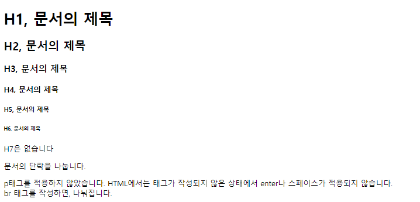
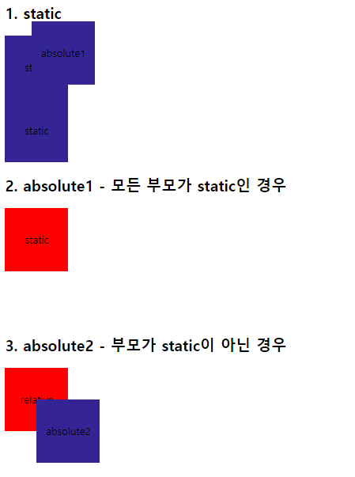

# WEB Basic

```
Web 개발에 필요한 기본 HTML, CSS, JS 지식을 정리해두었습니다💁
```

## 목차

* [HTML](#html)
* [CSS](#css)
* [JavaScript](#javascript)

## HTML

* [바로가기](./HTML)

```
HyperText Markup Language (HTML)📃의 기본 개념과 동작 원리
```

* Example

  [](./HTML)

## CSS

* [바로가기](./CSS)

```
웹페이지를 꾸며주는🎨 CSS를 공부하고 정리한 내용
```

* Example

  [](./CSS)

## JavaScript

* [바로가기](./javaScript)

```
🙌기본적인 Type, Variable부터 Callback, Promise까지!
JavaScript의 문법과 여러 Web API들의 사용법을 익혀보자!
```

