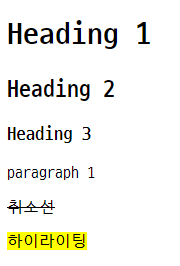
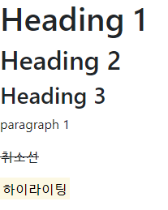
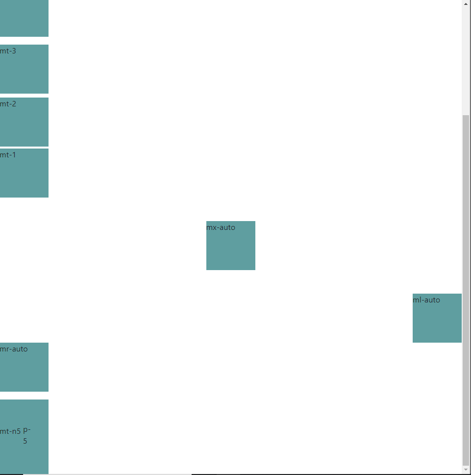
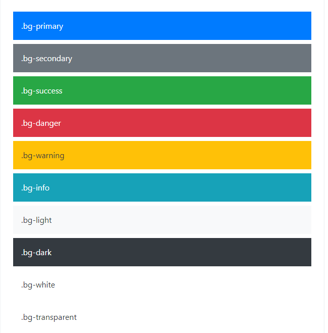
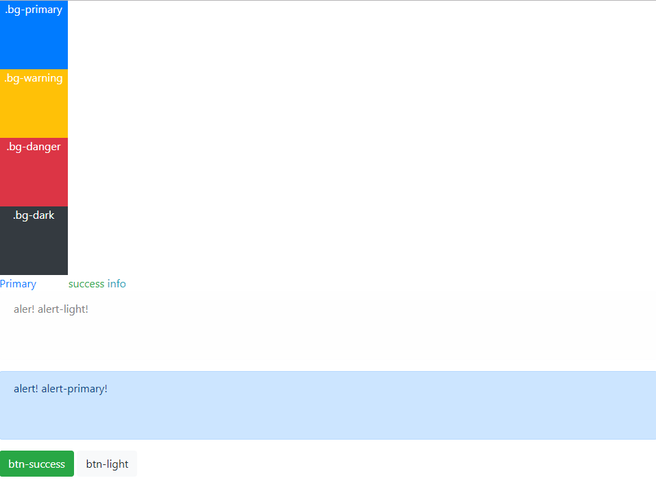

# Bootstrap

## 1. Intro

* [Bootstrap 홈페이지](https://getbootstrap.com/)

* BootstrapCDN
  * CSS only (head에 추가)

    ```html
    <!-- CSS는 head에 -->
      <link rel="stylesheet"     href="https://stackpath.bootstrapcdn.com/bootstrap/4.3.1/css/bootstrap.min.css"integrity="sha384-ggOyR0iXCbMQv3Xipma34MD+dH/1fQ784/j6cY/iJTQUOhcWr7x9JvoRxT2MZw1T" crossorigin="anonymous">
    ```
    
  * JS, Popper.js, and jQuery (body 닫는 태그 바로위에 추가)
  
    ```html
    <!-- javascript는 body 닫는 태그 바로 위에 -->
      <script src="https://code.jquery.com/jquery-3.3.1.slim.min.js" integrity="sha384-q8i/X+965DzO0rT7abK41JStQIAqVgRVzpbzo5smXKp4YfRvH+8abtTE1Pi6jizo" crossorigin="anonymous"></script>
      <script src="https://cdnjs.cloudflare.com/ajax/libs/popper.js/1.14.7/umd/popper.min.js" integrity="sha384-UO2eT0CpHqdSJQ6hJty5KVphtPhzWj9WO1clHTMGa3JDZwrnQq4sF86dIHNDz0W1" crossorigin="anonymous"></script>
      <script src="https://stackpath.bootstrapcdn.com/bootstrap/4.3.1/js/bootstrap.min.js" integrity="sha384-JjSmVgyd0p3pXB1rRibZUAYoIIy6OrQ6VrjIEaFf/nJGzIxFDsf4x0xIM+B07jRM" crossorigin="anonymous"></script>
    ```
  
* 기본 형태

  ```html
  <!DOCTYPE html>
  <html lang="ko">
  <head>
    <meta charset="UTF-8">
    <meta name="viewport" content="width=device-width, initial-scale=1.0">
    <meta http-equiv="X-UA-Compatible" content="ie=edge">
    <title>Document</title>
    <!-- CSS는 head에 -->
    <link rel="stylesheet" href="https://stackpath.bootstrapcdn.com/bootstrap/4.3.1/css/bootstrap.min.css" integrity="sha384-ggOyR0iXCbMQv3Xipma34MD+dH/1fQ784/j6cY/iJTQUOhcWr7x9JvoRxT2MZw1T" crossorigin="anonymous">
  </head>
  <body>
    <!-- reboot.css를 통해서 기본 브라우저 태그의 속성값을 초기화함. -->
    <!-- javascript는 body 닫는 태그 바로 위에 -->
    <script src="https://code.jquery.com/jquery-3.3.1.slim.min.js" integrity="sha384-q8i/X+965DzO0rT7abK41JStQIAqVgRVzpbzo5smXKp4YfRvH+8abtTE1Pi6jizo" crossorigin="anonymous"></script>
    <script src="https://cdnjs.cloudflare.com/ajax/libs/popper.js/1.14.7/umd/popper.min.js" integrity="sha384-UO2eT0CpHqdSJQ6hJty5KVphtPhzWj9WO1clHTMGa3JDZwrnQq4sF86dIHNDz0W1" crossorigin="anonymous"></script>
    <script src="https://stackpath.bootstrapcdn.com/bootstrap/4.3.1/js/bootstrap.min.js" integrity="sha384-JjSmVgyd0p3pXB1rRibZUAYoIIy6OrQ6VrjIEaFf/nJGzIxFDsf4x0xIM+B07jRM" crossorigin="anonymous"></script>
  </body>
  </html>
  ```

* 기존 html과 bootstrap의 차이

  * html

  

  * bootstrap 적용

    

## 2. Sapcing

* [Bootstrap Spacing](https://getbootstrap.com/docs/4.3/utilities/spacing/)

* property

  * `m` - for classes that set `margin`
  * `p` - for classes that set `padding` 

* sides

  * `t` - for classes that set `top`
  * `b` - for classes that set `bottom`
  * `l` - for classes that set `left`
  * `r` - for classes that set `right`
  * `x` - for classes that set both `left, right`
  * `y` - for classes that set both `top, bottom`
  * blank - for classes that set all 4 sides of the element

* size

  * `0` - for classes that eliminate  the `margin` or `padding` by setting it to `0`
  * `1` - (by default) for classes that set the `margin` or `padding` to `$spacer * .25`
  * `2` - (by default) for classes that set the `margin` or `padding` to `$spacer * .5`
  * `3` - (by default) for classes that set the `margin` or `padding` to `$spacer`
  * `4` - (by default) for classes that set the `margin` or `padding` to `$spacer * 1.5`
  * `5` - (by default) for classes that set the `margin` or `padding` to `$spacer * 3`
  * `auto` - for classes that set the `margin` to auto

* 코드

  ```html
  ...
  <head>
    <style>
    div{
      width: 100px;
      height: 100px;
      background: cadetblue;
    }
    </style>
  </head>
  <body>
    <div></div>
    <div class="mt-5">mt-5</div>
    <div class="mt-4">mt-4</div>
    <div class="mt-3">mt-3</div>
    <div class="mt-2">mt-2</div>
    <div class="mt-1">mt-1</div>
    <div class="mx-auto my-5">mx-auto</div>
    <div class="ml-auto">ml-auto</div>
    <div class="mr-auto">mr-auto</div>
    <div class="p-5 mt-3">p-5</div>
    <div class="mt-n5">mt-n5</div>
    ...
    ...
  </body>
  ...
  ```

  

* 출력

  

## 3. Color

* [Bootstrap Color](https://getbootstrap.com/docs/4.3/utilities/colors/)

  

* 코드

  ```html
  ...
  <head>
  <style>
  div {
    width: 100px;
    height: 100px;
  }
  </style>
  </head>
  <body>
    <!-- background color : 특정색 -->
    <div class="bg-primary text-center text-white">.bg-primary</div>
    <div class="bg-warning text-center text-white">.bg-warning</div>
    <div class="bg-danger text-center text-white">.bg-danger</div>
    <div class="bg-dark text-center text-white">.bg-dark</div>
  
    <span class="text-primary">Primary</span>
    <span class="text-white">white</span>
    <span class="text-success">success</span>
    <span class="text-info">info</span>
  
    <div class="alert alert-light" style="width: 100%">
      aler! alert-light!
    </div>
  
    <div class="alert alert-primary" style="width: 100%">
      alert! alert-primary!
    </div>
  
    <button class="btn btn-success">
      btn-success
    </button>
    <button class="btn btn-light">
      btn-light
    </button>
    ...
    ...
  </body>
  ...
  ```

* 출력

  

## 4. Border

* [Bootstrap Borders](https://getbootstrap.com/docs/4.3/utilities/borders/)

* 코드

  ```html
  ...
  <body>
    <div class="border border-primary bg-light">
      파란선
    </div>
    <div class="border border-danger">
      빨간선
    </div>
    <!-- top, right, bottom, left 각각 지정 가능 -->
    <div class="border-right">
      오른쪽 경계선
    </div>
    <div class="border-left border-warning">
      왼쪽 노란 경계선
    </div>
    
    
    
    
    ...
    ...
  </body>
  ...
  ```

* 출력

  


## 5. Display

* [Bootstrap display](https://getbootstrap.com/docs/4.3/utilities/display/)
* 

