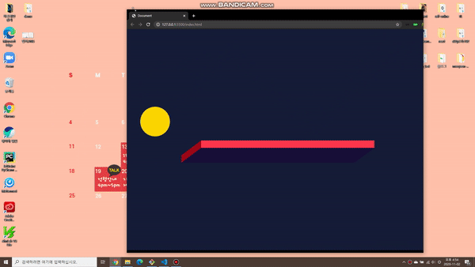
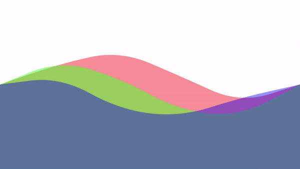
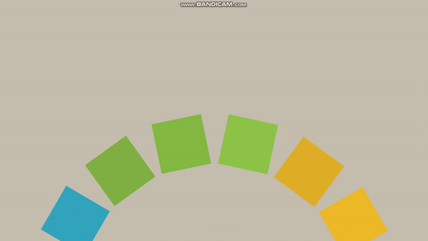
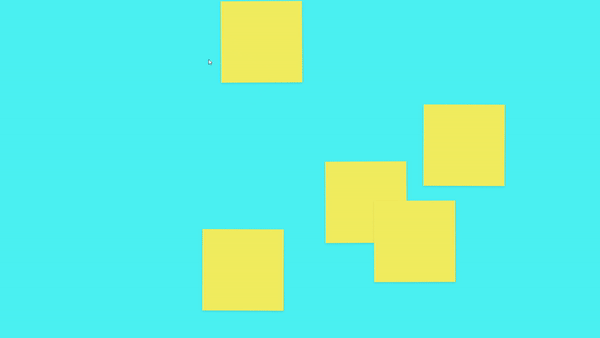
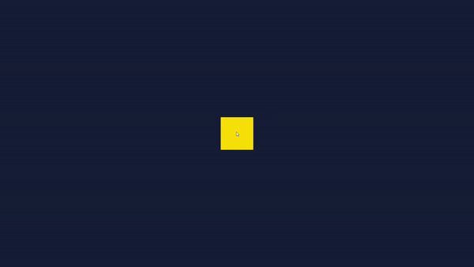

# CANVAS TUTORIAL

## MENU

- [Bouncing Ball](#bouncing-ball)
- [Air Cap Wave](#air-cap-wave)
- [Moving Waves](#moving-waves)
- [Moving Gradient](#moving-gradient)
- [Rotating Polygon](#rotating-polygon)
- [Bounce Strings](#bounce-strings)
- [Hanging Box](#hanging-box)
- [Rotating Globe](#rotating-globe)
- [3D Cube](#3D-cube)

## Bouncing Ball

- [코드](./bouncing_ball)

- 실행화면

  

## Air Cap Wave

* [코드](./air_cap_wave)

* 실행화면

  

## Moving Waves

* [코드](./moving_waves)

* 실행화면

  

## Moving Gradient

* [코드](./moving_gradient)

* 실행화면

  

## Rotating Polygon

* [코드](./rotating_polygon)

* 실행화면

  

## Bounce Strings

* [코드](./bounce_strings)

* 실행화면

  

## Hanging Box

* [코드](./hanging_box)

* 실행화면

  

## Rotating Globe

* [코드](./rotating_globe)

* 실행화면

  

## 3D Cube

* [코드](./3D_cube)

* 실행화면

  