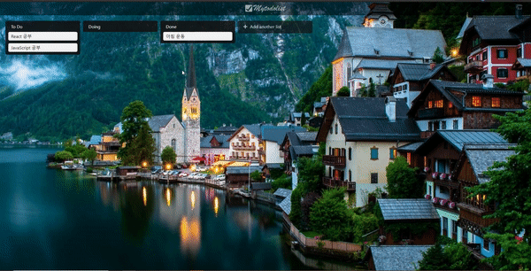

# Front End

## 목차

* [같이 보면 좋은 자료들](#같이-보면-좋은-자료들)
* [Angular vs React vs Vue](#angular-vs-react-vs-vue)
* [Interactive Development](#interactive-development)
* [React](#react)
* [Vue](#vue)

## 같이 보면 좋은 자료들

:loudspeaker: ​공부하면서 많은 도움이 되었던 유익한 자료들!

### Youtube 채널 드림코딩 by 엘리

* [채널 바로가기](https://www.youtube.com/channel/UC_4u-bXaba7yrRz_6x6kb_w)

```
호주에서 프론트앤드 개발자💼로 근무하고 계시는 엘리님의 유튜브 채널📺
프론트앤드 개발에 필요한 전반적인 지식🎓을 이해하기 쉽게 잘설명해준다.
드림코딩 아카데미 유료강의💰도 모두 듣는 것을 추천
```

### Youtube 채널 Interactive Developer

* [채널 바로가기](https://www.youtube.com/channel/UCdeWxKJuvtUG2xyN6pOJEvA)

```
구글에서 Interactive Developer💼로 근무하고 계시는 김종민님의 유튜브 채널📺
canvas🎨를 활용해 만든 재미있는 디자인의 Interactive 화면을 보고 따라할 수 있다.
JS class 활용법을 공부하고 이해하는데 많은 도움이 되었고 재미있게😂 따라할 수 있어 심심할때 보기 좋다.
```

## Angular vs React vs Vue

* [바로가기](./angular_vs_react_vs_vue)

```
대표적인 FE Framework
Angular, React, Vue에 대해 비교한 자료를 찾아보고 정리📋하였습니다.
```

## Interactive Development

* [바로가기](./Interactive)

```
canvas🎨에 JS event loop와 수학 공식을 더해주면 Interactive한 화면이?!
3D Cube부터 통통 튀어다니는 공까지 재미있는 실습을 통해 완성도 높은 페이지를 만들어보자!
```


## React

* [바로가기](./react)

```
페이스북에서 만든 현재 가장 많은 사람들👪이 이용하는 Front-end Library
현업👔에서 많이 쓰이는 기술 스택을 익혀보자
```



## Vue

* [바로가기](./vue)

```
최근 뜨고있는 Frontend Framework
공식문서📚가 잘 작성되어있어 처음 배울경우 공식문서만 보고도 어느정도 웹 페이지를 제작할 수 있어 진입장벽이 낮다
React 다음으로 현업👔에서 많이 쓰고있는 Vue에 대해 알아보자
```


