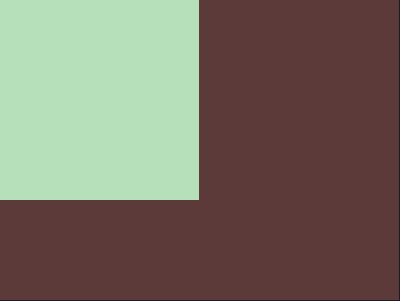
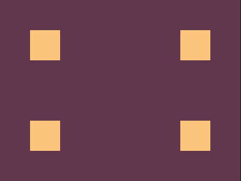
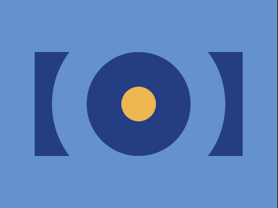
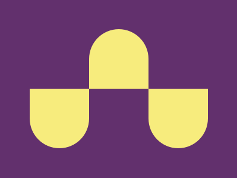
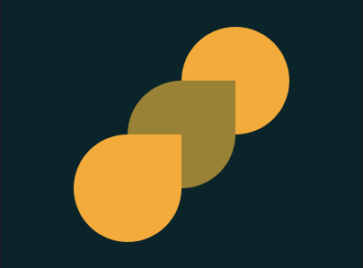
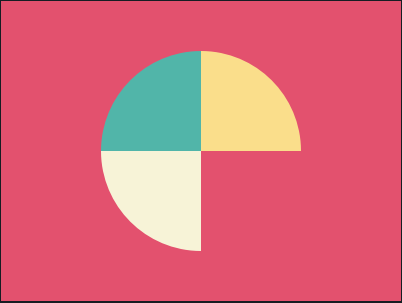
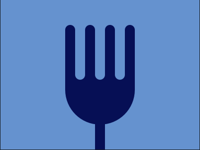
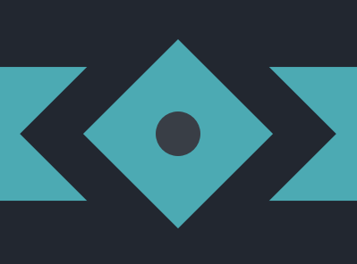

# Battle #1 Pilot Battle

> [사이트 바로가기](https://cssbattle.dev/battle/1)

## 목차

* [Target #1 Simply Square](#target-1-simply-square)
* [Target #2 Carrom](#target-2-carrom)
* [Target #3 Push Button](#target-3-push-button)
* [Target #4 Ups n Downs](#target-4-ups-n-downs)
* [Target #5 Acid Rain](#target-5-acid-rain)
* [Target #6 Pilot Battle](#target-6-pilot-battle)
* [Target #7 Leafy Trail](#target-7-leafy-trail)
* [Target #8 Forking Crazy](#target-8-forking-crazy)
* [Target #9 Tesseract](#target-9-tesseract)

## Target #1 Simply Square

* [문제](https://cssbattle.dev/play/1)

  

* 풀이

  ```html
  <div></div>
  <style>
    * {
      margin: 0;
      background: #5d3a3a;
    }
    div {
      width: 200px;
      height: 200px;
      background: #b5e0ba;
    }
  </style>
  
  ```

  * 먼저 body의 margin을 지워주고 div크기를 맞춰주었다.

## Target #2 Carrom

* [문제](https://cssbattle.dev/play/2)

  

* 풀이

  ```html
  <div id="first"></div>
  <div id="second"></div>
  <div id="third"></div>
  <div id="fourth"></div>
  <style>
    body {
      margin: 0;
      background: #62374e;
    }
    div {
      position: absolute;
      width: 50px;
      height: 50px;
      background: #fdc57b;
    }
    #first {
      top: 50px;
      left: 50px;
    }
    #second {
      top: 50px;
      right: 50px;
    }
    #third {
      bottom: 50px;
      left: 50px;
    }
    #fourth {
      bottom: 50px;
      right: 50px;
    }
  </style>
  ```

  * 기본적인 방법을 통해서 구현해주었다.
  * 4개의 `<div>`를 만들고 각각의 속성에 `top, bottom, left, right` 옵션을 주었다.

## Target #3 Push Button

* [문제](https://cssbattle.dev/play/3)

  

* 풀이

  ```html
  <div id="square">
    <div id="big">
      <div id="middle">
        <div id="small"></div>
      </div>
    </div>
  </div>
  <style>
    * {
      margin: 0;
      background: #6592CF;
    }
    
    div {
      position: relative;
    }
    
    #square {
      top: 75px;
      left: 50px;
      width: 300px;
      height: 150px;
      background: #243D83;
    }
    
    #big {
      top: -50px;
      left: 25px;
      width: 250px;
      height: 250px;
      border-radius: 125px;
      background: #6592CF;
    }
    
    #middle {
      top: 50px;
      left: 50px;
      width: 150px;
      height: 150px;
      border-radius: 75px;
      background: #243D83;
    }
    
    #small {
      top: 50px;
      left: 50px;
      width: 50px;
      height: 50px;
      border-radius: 25px;
      background: #EEB850;
    }
  </style>
  ```

  * `border-radius`를 활용해 원을 만들어줄 수 있다.

## Target #4 Ups n Downs

* [문제](https://cssbattle.dev/play/4)

  

* 풀이

  ```html
  <div class="downs"></div>
  <div class="ups"></div>
  <div class="downs"></div>
  <style>
    body {
      margin: 50px 50px;
      display: flex;
      background: #62306D;
    }
    div {
      position: relative;
      width: 100px;
      height: 100px;
      background: #F7EC7D;
    }
    .downs {
      top: 100px;
      border-radius: 0 0 50px 50px;
    }
    .ups {
      border-radius: 50px 50px 0 0;
    }
  </style>
  ```

  * Flex Box를 활용하여 `<div>`를 한줄로 나타내준다.
  * `ups`와 `downs`로 모양이 나눠져있어 `class`를 두가지로 나눠주었다. 이후 각각의 위치와 모양에 맞게 `top`, `border-radius` 속성을 주어 해결하였다.

## Target #5 Acid Rain

* [문제](https://cssbattle.dev/play/5)

  

* 풀이

  ```html
  <div id="top"></div>
  <div id="middle"></div>
  <div id="bottom"></div>
  <style>
    body {
    	margin: 0;
      background: #0B2429;
    }
    
    div {
      position: absolute;
      width: 120px;
      height: 120px;
    }
    
    #top {
      top: 30px;
      right: 80px;
      background: #F3AC3C;
      border-radius: 50%;
    }
    
    #middle {
      top: 90px;
      left: 140px;
      background: #998235;
      border-radius: 50% 0 50% 50%;
    }
    
    #bottom {
      bottom: 30px;
      left: 80px;
      background: #F3AC3C;
      border-radius: 50% 0 50% 50%;
    }
  </style>
  ```

## Target #6 Pilot Battle

* [문제](https://cssbattle.dev/play/6)

  

* 풀이

  ```html
  <div id="container">
    <div id="green" class="contants"></div>
    <div id="yellow" class="contants"></div>
    <div id="white" class="contants"></div>
  </div>
  <style>
    body {
      margin: 0;
      background: #E3516E;
    }
    
    #container {
      top: 50px;
      left: 100px;
      width: 200px;
      position: relative;
      display: flex;
      flex-wrap: wrap;
      border-radius: 50%;
      overflow: hidden;
    }
    
    .contants {
      width: 100px;
      height: 100px;
    }
    
    #green {
      background: #51B5A9;
    }
    
    #yellow {
      background: #FADE8B;
    }
    
    #white {
      background: #F7F3D7;
    }
  </style>
  ```

## Target #7 Leafy Trail

* [문제](https://cssbattle.dev/play/7)

  

* 풀이

  ```html
  <div id="back"></div>
  <div id="mid"></div>
  <div id="front"></div>
  <style>
    body {
      margin: 0;
      background: #0B2429;
    }
    
    div {
      position: absolute;
      top: 75px;
      height: 150px;
      width: 150px;
      border-radius: 100px 0 100px 0;
    }
    
    #front {
      right: 75px;
      background: #F3AC3C;
    }
    
    #mid {
      left: 125px;
      background: #998235;
    }
    
    #back {
      left: 75px;
      background: #1A4341;
    }
  </style>
  ```

## Target #8 Forking Crazy

* [문제](https://cssbattle.dev/play/8)

  

* 풀이

  ```html
  <div id="fork-head"></div>
  <div id="container">
    <div class="pinch dark"></div>
    <div class="pinch light"></div>
    <div class="pinch dark"></div>
    <div class="pinch light"></div>
    <div class="pinch dark"></div>
    <div class="pinch light"></div>
    <div class="pinch dark"></div>
  </div>
  <div id="fork-body"></div>
  <style>
    body {
      margin: 0;
      background: #6592CF;
    }
    
    #container {
      display: flex;
      position: absolute;
      width: 140px;
      top: 50px;
      left: 130px;
    }
    .pinch {
      width: 20px;
      height: 110px;
      border-radius: 10px;
    }
    
    .dark {
      background: #060F55;
    }
    
    .light {
      background: #6592CF;
    }
    
    #fork-head {
      position: absolute;
      width: 140px;
      height: 140px;
      bottom: 50px;
      left: 130px;
      background: #060F55;
      border-radius: 0 0 50% 50%;
    }
    
    #fork-body {
      position: absolute;
      width: 20px;
      height: 60px;
      bottom: 0;
      left: 190px;
      background: #060F55;
    }
  </style>
  ```

## Target #9 Tesseract

* [문제](https://cssbattle.dev/play/9)

  

* 풀이

  ```html
  <div id="back">
    <div id="big">
      <div id="small">
        <div id="circle"></div>
      </div>
    </div>
  </div>
  <style>
    body {
      margin: 0;
      background: #222730;
    }
    div {
      display: flex;
      align-items: center;
      justify-content: center;
    }
    
    #back {
      position: relative;
      top: 75px;
      width: 100%;
      height: 150px;
      background: #4CAAB3;
    }
    
    #big {
      width: 250px;
      height: 250px;
      background: #222730;
      transform: rotate(45deg);
    }
    
    #small {
      width: 150px;
      height: 150px;
      background: #4CAAB3;
    }
    
    #circle {
      width: 50px;
      height: 50px;
      background: #393E46;
      border-radius: 50%;
    }
  </style>
  ```

