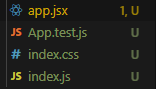
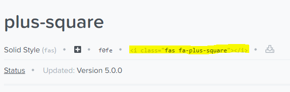

# React Basic

## 전반적인 개념

### Component

* Class와 Function 두가지 형태로 만들 수 있다.

* Class

  >  React.Component, React.PureComponent

  

  ```react
  class LikeButton extends Component {
      state = {};
  	render() {}
  }
  ```

  * React에서 제공하는 Component 클래스를 extends, 상속해서 만들 수 있다.
  * 내 Component에 State가 있고 그 상태에 따라 Component가 주기적으로 업데이트 되어야 할 때
  * Component에서 가지고 있는 상태, 데이터를 담을 수 있는 `state` object가 들어있다.
  * `state`가 변경이 되면 `render()` 함수가 호출 되면서 업데이트된 내용이 사용자에게 보여짐
  * lifecycle methods
    * 다양한 컴포넌트의 상태에 따라서 우리가 함수를 구현해 놓으면 알아서 불러주는 Method가 있다.
      * Component가 사용자에게 보여질때
      * DOM tree에 올라갔을 때
      * DOM tree에서 나왔을 때
      * Component가 업데이트 되었을 때

* Function

  > function, memo(function), React Hook

  

  ```react
  function App() {
      return <h1>Hello</h1>
  }
  ```

  * 내 Component에 상태가 없고 정적으로 데이터가 표시될 때
  * `state`, lifecycle methods가 없다. (16.8 이전 버전)
  * React Hook(16.8 버전부터)
    * `state`, lifecycle methods를 사용할 수 있게 됨
    * 기존에 Class Component에서 할 수 있던 기능을 Function에서도 가능하도록 해주었다.
    * 개발 배경
      * Class 구조에 익숙하지 않은 개발자들이 많다.
      * Class에서 멤버변수에 접근할 때 항상 `this.`을 붙여야해서 불편하다.
      * Class의 Binding issue
      * Functional programming의 유행
      * 중복되는 코드를 줄일 수 있다.

## Template 프로젝트 만들기

### Project 생성

```bash
yarn create react-app template
```

### 사용하지 않는 파일 삭제

* 다음 파일들은 아직 사용하지 않으므로 제거

    ```
    \template
    ├── public
    |  ├── logo192.png
    |  ├── logo512.png
    |  ├── manifest.json
    |  └── robots.txt
    ├── src
    |  ├── App.test.js
    |  ├── logo.svg
    |  ├── reportWebVitals.js
    |  └── setupTests.js
    ```
    
* 최종 Directory Tree 형태

    ```
    
    ```

    * `components/` : 공통적으로 사용하는 component들을 보통 하나의 폴더로 묶어서 관리해준다.

    * 파일이름은 보통 소문자로 시작한다.

    * react component 파일은 `.jsx` 로 저장하여 JavaScript 파일과 구분

      

      

## 간단한 프로젝트로 배우기

> Habit tracker

### Template 복사하기

```bash
cp -R template habit-tracker
```

* template의 상위 디렉토리에서 입력

### React Dom

* 우리가 만든 컴포넌트를 `html`과 연결해 준다.

* `index.html`

  ```html
  <body>
      ...
      ...
      <div id="root"></div>
  </body>
  ```

* `index.js`

  ```react
  ReactDOM.render(
    <React.StrictMode> // js의 "use strict"와 같은
      <App />
    </React.StrictMode>,
    document.getElementById("root")
  );
  ```

* `index.html`의 `root div` 에 최상위 컴포넌트인 `App`을 연결해준다.

### JSX 정리

> React Component와 JavaScript code 파일을 구분하기 위해 `app.jsx` 로 만들어주었다. 그럼 JSX란 무엇일까?

* 공식문서

  * [Introducing JSX](https://reactjs.org/docs/introducing-jsx.html)
  * [JSX In Depth](https://reactjs.org/docs/jsx-in-depth.html)

* JSX가 없었을때 React 작성법

  ```react
  function App() {
      return React.createElement('h1', {}, 'Hello:)');
  }
  ```

  * 코드가 복잡하고 어려웠다.

* `html` 처럼 입력할 수 있도록 해주는 JSX

  ```react
  function App() {
      return <h1>Hello:)</h1>
  }
  ```

  * `html`처럼 작성할 수 있지만 JSX는 JavaScript code이다.

* 비즈니스 로직 작성

  ```react
  function App() {
      const name = 'moo';
      return <h1>Hello {name} :)</h1>
  }
  ```

  ```react
  function App() {
      const name = 'moo';
      return (
          <>
              {name && <h1>Hello! {name}:)</h1>}
              // name이 있다면 && 뒤의 태그를 출력
          	
              {[1, 2].map(item => 
              	(<h1>{item}</h1>)}
          <>
      )
  }
  ```

  

* `tag` 묶어주기 

  * `<div></div>`

      ```react
      function App() {
          const name = 'moo';
          return (
              <div>
                  <h1>Hello! {name} :)</h1>
                  <h1>Hello!</h1>
              </div>
          )
      }
      ```
      
      * div tag가 만들어짐
      
  * `React.Fragment`

      ```react
      function App() {
          const name = 'moo';
          return (
              <React.Fragment>
                  <h1>Hello! {name} :)</h1>
                  <h1>Hello!</h1>
              </React.Fragment>
          )
      }
      ```

      * 따로 tag 가 만들어지지 않고 묶어준다.

  * 의미 없이 단순히 그룹으로 묶어주고만 싶을때

      ```react
      function App() {
          const name = 'moo';
          return (
              <>
                  <h1>Hello! {name} :)</h1>
                  <h1>Hello!</h1>
              </>
          )
      }
      ```

      * tag안을 비워도 동작한다.

### Habit tracker

#### habit component 만들기

* `rcc` + tap 을 누르면 자동으로 기본적인 코드가 써진다

  (React code snippet extension이 설치된 경우)

* file name은 소문자로 class name은 대문자로 시작!

  `rcc` + tap을 사용할 경우 파일명과 똑같이 써주므로 고쳐줘야한다.

#### Fontawesome 추가

* 설치

  ```bash
  yarn add @fortawesome/fontawesome-free
  ```

* 공식문서

  * https://fontawesome.com/how-to-use/on-the-web/using-with/react

* Fontawesome에서 검색해서 추가하기

  * 상단 검색창에서 원하는 icon 검색

  * 원하는 아이콘 선택후 태그를 클릭하면 복사된다.

    

  * react에서는 `className`을 쓰므로 `class`를 `className` 으로 고쳐준다.