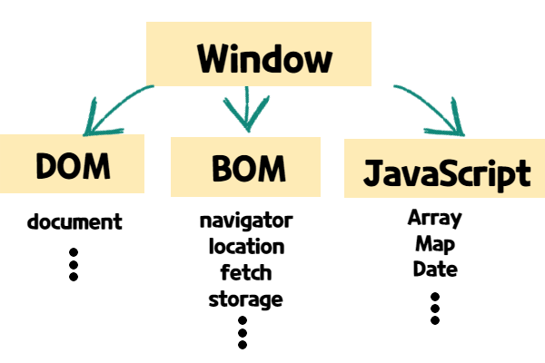

# WEB APIs

## 목차

* [API란](#api란)
* [WEB APIs란](#web-apis란)
* [Browser 구조 분석](#browser-구조-분석)

## API란

> Application Programming Interfaces

 우리가 자판기를 사용할 때 자판기에서 내부 구조가 어떻게 되어있는지, 자판기가 어떻게 동작하는지 전혀 몰라도 자판기에 동전을 넣고 버튼을 누르면 간단하게 우리가 원하는 기능을 수행할 수 있다.

 이와 마찬가지로 우리가 Windows에 대해서 어떤 어플리케이션을 만들고 싶다면 Windows에서 제공하는 API를 사용하여 간단하게 윈도우 어플리케이션을 만들 수 있다. 안드로이드나 유튜브 플렛폼등 다른 곳에서도 마찬가지일 것이다.

 또한 이런 OS나 플렛폼에서 제공하는 API 외에도 우리가 작성하는 프로젝트에서 만약 `UserStorage` 라는 Class를 만들고 그 안에 login, logout 기능들이 있다면 이 것도 `UserStorage` Class에서 제공하는 API라고 말할 수 있다. login, logout을 사용하는 유저들은 login, logout 함수들이 내부적으로 어떻게 이루어져 있는지 몰라도 어떤값을 넣어주면 어떤 것이 리턴되는지 알 수 있다.

## WEB API란

> 브라우저에는 공통적으로 제공하기로 약속한 API들이 많다. 
>
> 예시)
>
> * DOM APIs
> * Network APIs
> * Graphics APIs
> * Audio/Vidio APIs
> * Device APIs
> * File APIs
> * Storage APIs

### APIs 확인하기

* [MDN Web APIs](https://developer.mozilla.org/en-US/docs/Learn/JavaScript/Client-side_web_APIs/Introduction)

## Browser 구조 분석

* **Window** 

  Browser에서 현재 열려있는 전체적인 창

* **Document**

  페이지가 표시되는 부분

  Html로 작성한 요소들이 표기되어지는 부분

* **Navigator**

  사용자에게는 보여지지 않지만 Browser 자체에 대한 정보들이 담겨있다.

* DOM(Document Object Model)

  화면에 새로운 요소를 추가, 제거 혹은 움직일 수 있다.

* BOM(Browser Object Model)

  Web APIs에 관련된 Object들이 들어있다.

* JavaScript

## Window

* [MDN Window](https://developer.mozilla.org/en-US/docs/Web/API/Window)

* global Object이므로 console 창에서 `console.log(this)`를 입력해보면 `window`가 찍히는 것을 볼 수 있다.

  따라서 우리가 `window.innerWidht`라고 입력하지 않고 `innerWidth`라고만 입력해주어도 `window.innerWidth`가 표시되는 것을 확인 할 수 있다.

* 주로 사용되는 곳

  1. Size

     현재 윈도우의 크기가 몇인지, 윈도우의 크기가 변화하는지

  2. Scroll

     사용자가 스크롤할 때 어떻게 처리할지

  3. load

     페이지가 로드되었는지, 우리가 작성한 웹페이지가 브라우저에 올라왔는지 확인

### Window 사이즈 표기

