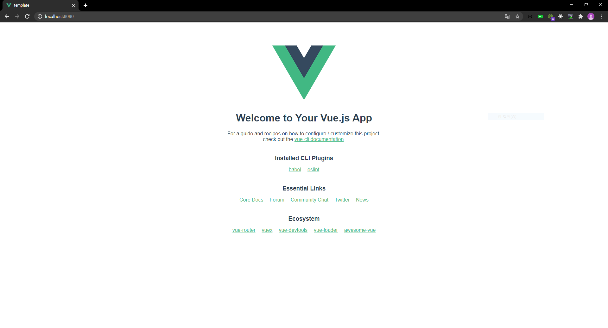

# Vue

## 목차

* [필요한 툴 설치](#필요한-툴-설치)
* [Getting Started](#getting-started)


## 필요한 툴 설치

### node.js

* node.js 란?

  * 어느곳에서나 JavaScript로 프로그래밍이 가능하게 하는 framework
  * server-side rendering, command line tools 등에 사용

* npm 이란?

  * Package Manager
  * library, package 들을 쉽게 관리할 수 있도록 해줌
  * `package.json` 파일안에 사용하는 외부 라이브러리들과 버전 정보들이 들어있다.

* npx 란?

  * 원하는 library, package를 실행할 수 있도록 해줌

  * 실행하는 방법

    ```bash
    npx "some-package"
    ```

* [node.js 공식사이트](https://nodejs.org/en/)

  

* node, npm version 확인

  ```bash
  node -v
  v14.15.1
  
  npm -v
  6.14.8
  ```


## Vue 개발환경 만들기

### `package.json` 파일 생성

```bash
npm init
```

### Vue 설치

```bash
npm install vue
```

### Webpack 설치 

>  `webpack.config.js` 파일 생성

```bash
npm install webpack webpack-cli -D
```

* webpack은 개발환경에서 `모듈 번들러`로써 활용하기 위한 것으로 `-D`옵션을 통해 `package.json`에서 `DevDependencies`에 추가

### webpack.config.js 파일 생성

```js
// webpack 설정
const VueLoaderPlugin = require('vue-loader/lib/plugin')
const path = require('path')

module.exports = {
    mode: 'development', // vue에서 개발자 도구 쓰게 해줌 
    // 여러개의 파일을 읽어오기
    entry: {
        app: path.join(__dirname, 'src', 'main.js') // src에 있는 main.js
    },
    // 관련된 모듈
    module: {
        rules: [
            {
                test: /\.vue$/, // .vue 확장자는
                use: 'vue-loader', // 모두 vue-loader로 번역을 해라
            }
        ]
    },
    plugins: [
        new VueLoaderPlugin() // vue loader가 가지고 있는 plugin을 불러오겠다.
    ],
    // 최종 결과 (.js)
    output: {
        filename: 'app.js',
        path: path.join(__dirname, 'dist') // 결과를 이 경로로 던져줘!
    }
}
```

### main.js 생성

```js
import vue from 'vue' // vue 자체를 불러옴
import App from './App.vue' // 내가 만든 vue 파일

new Vue({
    el: '#app', 
    // 렌더링
    render: function(createElement) {
        createElement(App)
    }
})
```

### App.vue 생성

```html
<!-- 기본 구조 --> 
<template>
    <h1> 이게 싱글파일컴포넌트, 최상위 컴포넌트입니다. </h1>
</template>
<script>
export default {

}
</script>
<style lang="">

</style>
```

### Vue 파일들을 번역, 불러오기 위한 작업

```bash
npm install vue-loader vue-template-compiler -D
```

* `vue-loader` : Vue 파일을 불러오는 역할
* `vue-template-compiler` : Vue 파일을 해석하는 역할

### index.html에 사용하기

```html
<script src="../dist/main.js"></script>
```

* 생성된 `main.js` 파일을 `index.html`에 위와 같이 삽입하면 Vue Component를 사용할 수 있다. 

### 변경사항 적용

```bash
npm run build
```

* 변경사항이 생긴다면 위 명령어로 적용해주자

### Style

> CSS 불러오기

```bash
npm install vue-style-loader css-loader -D
```

* `vue-style-loader` : vue의 style
* `css-loader` : webpack css를 불러오는 로더

```js
// webpack.config.js // module -> rules 에 추가
{
    test: '/\.css$/',
    use: ['vue-style-loader', 'css-loader'] // 앞에꺼가 css를 만들거고 뒤에꺼가 불러와서 처리해준다
}
```


## @vue/cli

> 위의 복잡한 과정들을 자동으로 처리해주는 package

```bash
npm install -g @vue/cli
```


## Getting Started

> `@vue/cli`의 `vue create` 로 생성되는 프로젝트에는 어떤 것들이 있는지 알아본다.

* [공식 문서](https://cli.vuejs.org/guide/creating-a-project.html#vue-create)

### Project 생성

```bash
vue create 'project name'
```

* `vue` 2.x version, `npm` module을 사용하였다.
* 처음 생성시 1분정도 소요

### Project 실행

```bash
npm run serve
```



### Project 중지

`ctrl + c`

## Project 구조

```
template/
├── babel.config.js
├── node_modules
├── package-lock.json
├── package.json
├── public
|  ├── favicon.ico
|  └── index.html
├── README.md
└── src
   ├── App.vue
   ├── assets
   ├── components
   └── main.js
```

### babel.config.js

* [공식 문서](https://babeljs.io/docs/en/configuration)
* Babel
  * JavaScript transcompiler
  * ECMAscript 2015+ 버전의 코드를 이전 버전으로 변환해준다.
  * TypeScript, JSX 를 JavaScript로 변환해준다.
* Babel 환경 설정을 위한 파일

### node_modules

* 외부 라이브러리를 추가했을때 자동적으로 추가됨
* 라이브러리 구조 확인 가능

### package-lock.json

* [공식 문서](https://docs.npmjs.com/cli/v6/configuring-npm/package-lock-json)
* npm을 사용해서 `node_modules` 트리나 `package.json` 파일을 수정하게되면 자동으로 생성되는 파일
* 파일이 생성되는 시점의 의존성 트리에 대한 정확한 정보를 가지고 있다.

### package.json

* npm에서 버전을 관리할때 내 프로그램에서 사용하는 외부 라이브러리와 그 라이브러리 들의 버전이 명시되어 있다.

  ```json
  {
    "name": "test",
    "version": "0.1.0",
    "private": true,
    "dependencies": {
      "@testing-library/jest-dom": "^5.11.4",
      ...
    },
    "devDependencies": {
      "@vue/cli-plugin-babel": "~4.5.0",
      ...
    },
    ...
  }
  ```

  * `name` : 어플리케이션 이름
  * `version` : 어플리케이션 버전
  * `private` : private or public
  * `dependencies` : 사용하는 외부 라이브러리
  * `devDependencies` : 개발에만 사용되는 외부 라이브러리

### public/

* 사용자에게 배포할 때 외부적으로 보여지는 것들
* `farvicon.ico`, `index.html` 등

### README.md

### src/

* 소스코드
* `main.js`, `App.vue` 등